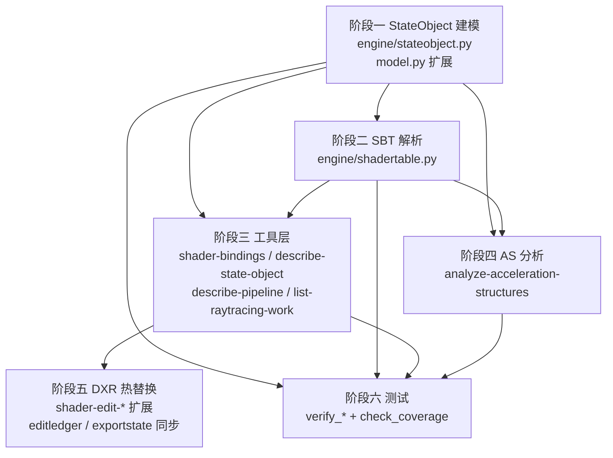

# DXR 光追 API 适配开发文档

- 文档版本：v1.1
- 编写日期：2026-08-12（v1.1 实施修订：2026-08-13）
- 代码基线：`9b724d3`（Report export cleanliness per injector; snapshot each edit's whole frame）
- 验证截帧：`C:\Users\vinmeng\Desktop\ManyLights\debug\Tiled.wpix`（会话名 `Tiled`）
- 导出目录：`C:\Users\vinmeng\Desktop\ManyLights\debug\Tiled.pixcache\cpp`
- 当前工具总数：84 →（实施后）88

---

## 0.5 实施结果与规格修正（v1.1，2026-08-13）

阶段一至阶段四 + 阶段六已实现，阶段五（DXR shader 热替换）按计划留待后续。实施中发现 v1.0 三处规格错误，均已在代码中按实测修正：

| # | v1.0 文档写法 | 实测事实 | 影响 |
|---|--------------|---------|------|
| 1 | `g_resourceReader->Read(dxilData_0_0, 6896)` 的 6896 是「`resources.bin` 块号」 | 6896 是**压缩字节数**。`resources.bin` 无索引表，blob 唯一地址是它在全局 `Read()` 序列中的序号。对象 3892 的 DXIL 真实 blob index 是 **297**（CreatePSOs.cpp 共 376 次 Read，前 297 属 PSO、后 79 属 state object） | 若按文档取 6896 当索引，读 DXIL 必然越界或读错 blob |
| 2 | 「79 个 COLLECTION + **4 个 RAYTRACING_PIPELINE**」 | RTPSO **对象只有 2 个**（3891、3930）。4 是 `RAYTRACING_PIPELINE` 类型的 **desc 段**数量：3891 占 1 段，3930 的 `AddToStateObject` 链占 3 段。合计对象数 79+2=**81**，与 `CreateStateObject_*` 函数数一致 | 验收脚本若断言 4 会永久失败 |
| 3 | `CreateShaderTable_01` 的 `&output[131072]` 记录归属 `miss` 表 | 该记录落在 **hit-group buffer 的尾部**（buffer 147456 字节 > 声明区域 131072 字节），而本次 dispatch 的 miss 区域指向 `CreateShaderTable_00` 填充的**另一个 buffer**。它是应用原始合并布局的复现，**不被本次 dispatch 读取** | 判为 hit_group 会错报 shader；判为 miss 会与真正的 miss 记录重复计数 |

针对第 3 点，`ShaderRecord` 新增 `in_declared_region` 字段，超出声明区域的记录标为 `<region>_buffer_tail` 且 `in_declared_region=false`，既不误归类也不丢弃。

顺带修复一个既有缺陷：`cppparse.parse_pipeline_states` 以 `CreatePipelineState_` 为锚但无结束边界，扫到同文件后半段 81 个 `CreateStateObject_*` 时不换锚，79 个 DXIL `Read()` 会反复覆盖最后一个 PSO（4119）的 `blob_index`，使其 shader 字节码指向光追库 blob。已加 `_RE_ANY_TOP_FUNC` 终止边界，同时保持 `read_sizes` 仍覆盖全部 376 次 Read（它是 blob 流的 fallback 索引，漏项会整体错位）。

**新增文件**：`engine/stateobject.py`、`engine/shadertable.py`、`engine/accelstructure.py`、`tools/raytracing_tools.py`；`tests/verify_state_object.py`（38 检查）、`verify_shader_table.py`（37）、`verify_acceleration_structures.py`（34）、`verify_raytracing_tools.py`（48）。

**新增工具 4 个**：`describe-state-object`、`describe-shader-table`、`list-raytracing-work`、`analyze-acceleration-structures`；升级 `shader-bindings`（光追从 `partial`+空 stages 变为 `success`+17 shader，global/local 绑定分列）、`pipeline-state`（返回 state object 而非报错）、`list-pipeline-states`（并列 81 个 state object）、`frame-stats`（新增 raytracing 段）。

**回归**：GBufferA 资源历史 25/25 行、像素 (810,284) 历史、ExecuteIndirect 绑定、选择器语义、`check_coverage`（51/51 需求项 + 88 工具 schema 完整）全部通过。`verify_global_id_uniqueness.py` 失败与本次改动无关，已用 `git stash` 在 HEAD 上复现（缺 `NoTiled.pixcache\cpp` 导出目录）。

---

## 0. 本文档与 2026-08-10 计划的差异（必读）


2026-08-10 那版计划留了一个可行性未决项：「需先确认 pixtool 是否导出完整 state object 构建链；若只导 `GetStateObject(id)`，需从 PIX 其他格式或 `resources.bin` 补充」。

本次已在真实导出上逐条核实，结论是**该疑虑不成立，且实际情况比预期好得多**，但同时暴露了三处与原计划假设相反的事实。原计划中受影响的部分在本文档中已重写。

| # | 原计划假设 | 实测事实 | 对计划的影响 |
|---|-----------|---------|-------------|
| 1 | pixtool 可能不导出 state object 构建过程 | **完整导出**。`CreatePSOs.cpp` 有 81 个 `CreateStateObject_<id>()` 函数，含全部子对象类型、DXIL 字节码偏移、export 重命名、local/global root signature 关联 | 阶段一从「可行性未知」变为「纯解析工作」，风险大幅下降 |
| 2 | SBT 需从 `DispatchRays` 调用参数解析 | **本帧没有任何字面 `DispatchRays` 调用**。光追全部走 `ExecuteIndirect`，`D3D12_DISPATCH_RAYS_DESC` 被写进 indirect argument buffer，构建代码在 `CreateAndInitResources_*.cpp` 的 `CreateIndirectArgumentBuffer_*()` 里 | 阶段二的解析入口完全改写：不再扫 CommandLists，而是扫 CreateAndInitResources + ShaderTableReconstruction |
| 3 | state object 是扁平的单一对象 | **两级结构**：79 个 `COLLECTION` + 4 个 `RAYTRACING_PIPELINE`，RTPSO 通过 `EXISTING_COLLECTION` 引用 collection，且用 `AddToStateObject` 三段增量构建（base → derived → final） | 阶段一必须建模「链接图」而非单个对象，否则 RTPSO 3930 会被解析成只有 7 个子对象的空壳 |

另有一处新增缺口（原八大缺口未涵盖）：**AS build 已被完整导出但完全未解析**，包括 `AccelStructureRecreation_000.cpp`（988KB，序列化 AS 反序列化重建）和 `RaytracingInstanceDescs_000.cpp`（TLAS instance 变换矩阵 + mask + flags）。

---

## 1. 实测导出格式详解（解析规格）

本节是所有解析代码的规格来源。每条格式都取自 `Tiled.pixcache/cpp`，含真实行号，实现时可直接对照。

### 1.1 State Object 构建 — `CreatePSOs.cpp`

**COLLECTION 形态**（`CreateStateObject_3892`，行 14864）：

```cpp
void CreateStateObject_3892()
{
    D3D12_STATE_OBJECT_DESC stateObjectDescs[1];

    D3D12_STATE_SUBOBJECT subobjects_0[10];
    D3D12_SHADER_BYTECODE dxilLib_0_0;
    std::vector<BYTE> dxilData_0_0;
    g_resourceReader->Read(dxilData_0_0, 6896);            // ← DXIL 在 resources.bin 的块号
    dxilLib_0_0 = { reinterpret_cast<BYTE*>(dxilData_0_0.data()), dxilData_0_0.size() };
    static D3D12_EXPORT_DESC exports_0_0[] = {
        { LR"(CHS_b5acc26ab7153489)", LR"(LumenHardwareRayTracingMaterialCHS)", D3D12_EXPORT_FLAG_NONE },
        { LR"(AHS_b5acc26ab7153489)", LR"(LumenHardwareRayTracingMaterialAHS)", D3D12_EXPORT_FLAG_NONE } };
    D3D12_DXIL_LIBRARY_DESC dxilLibDesc_0_0 = { dxilLib_0_0, 2, exports_0_0 };
    subobjects_0[0] = { D3D12_STATE_SUBOBJECT_TYPE_DXIL_LIBRARY, &dxilLibDesc_0_0 };

    static D3D12_RAYTRACING_SHADER_CONFIG raytracingShaderConfig_0_1 = { 16, 8 };   // payload, attrib
    subobjects_0[1] = { D3D12_STATE_SUBOBJECT_TYPE_RAYTRACING_SHADER_CONFIG, &raytracingShaderConfig_0_1 };

    static LPCWSTR exportsArray_0_2[] = { LR"(CHS_b5acc26ab7153489)", LR"(AHS_b5acc26ab7153489)" };
    D3D12_SUBOBJECT_TO_EXPORTS_ASSOCIATION subobjToExportsAssociation_0_2 = { &subobjects_0[1], 2, exportsArray_0_2 };
    subobjects_0[2] = { D3D12_STATE_SUBOBJECT_TYPE_SUBOBJECT_TO_EXPORTS_ASSOCIATION, &subobjToExportsAssociation_0_2 };

    static D3D12_HIT_GROUP_DESC hitGroupDesc_0_3 = { LR"(HitGroup_b5acc26ab7153489)",
        D3D12_HIT_GROUP_TYPE_TRIANGLES, LR"(AHS_b5acc26ab7153489)", LR"(CHS_b5acc26ab7153489)", nullptr };
    subobjects_0[3] = { D3D12_STATE_SUBOBJECT_TYPE_HIT_GROUP, &hitGroupDesc_0_3 };

    static D3D12_RAYTRACING_PIPELINE_CONFIG raytracingPipelineConfig_0_4 = { 1 };   // max recursion
    subobjects_0[4] = { D3D12_STATE_SUBOBJECT_TYPE_RAYTRACING_PIPELINE_CONFIG, &raytracingPipelineConfig_0_4 };

    static D3D12_STATE_OBJECT_CONFIG stateObjectConfig_0_5 = { D3D12_STATE_OBJECT_FLAG_ALLOW_STATE_OBJECT_ADDITIONS };
    subobjects_0[5] = { D3D12_STATE_SUBOBJECT_TYPE_STATE_OBJECT_CONFIG, &stateObjectConfig_0_5 };

    D3D12_GLOBAL_ROOT_SIGNATURE globalRootSig_0_6 = { GetRootSignature(3889) };
    subobjects_0[6] = { D3D12_STATE_SUBOBJECT_TYPE_GLOBAL_ROOT_SIGNATURE, &globalRootSig_0_6 };

    D3D12_LOCAL_ROOT_SIGNATURE localRootSig_0_7 = { GetRootSignature(3893) };
    subobjects_0[7] = { D3D12_STATE_SUBOBJECT_TYPE_LOCAL_ROOT_SIGNATURE, &localRootSig_0_7 };

    static LPCWSTR exportsArray_0_8[] = { LR"(CHS_b5acc26ab7153489)" };
    D3D12_SUBOBJECT_TO_EXPORTS_ASSOCIATION subobjToExportsAssociation_0_8 = { &subobjects_0[7], 1, exportsArray_0_8 };
    subobjects_0[8] = { D3D12_STATE_SUBOBJECT_TYPE_SUBOBJECT_TO_EXPORTS_ASSOCIATION, &subobjToExportsAssociation_0_8 };

    static LPCWSTR exportsArray_0_9[] = { LR"(AHS_b5acc26ab7153489)" };
    D3D12_SUBOBJECT_TO_EXPORTS_ASSOCIATION subobjToExportsAssociation_0_9 = { &subobjects_0[7], 1, exportsArray_0_9 };
    subobjects_0[9] = { D3D12_STATE_SUBOBJECT_TYPE_SUBOBJECT_TO_EXPORTS_ASSOCIATION, &subobjToExportsAssociation_0_9 };

    stateObjectDescs[0] = { D3D12_STATE_OBJECT_TYPE_COLLECTION, 10, subobjects_0 };
    CreateAndTrackStateObject(3892, stateObjectDescs);
}
```

可提取的每一项：

| 项 | 来源 | 备注 |
|---|------|------|
| state object id | `CreateAndTrackStateObject(3892, ...)` 或函数名 `CreateStateObject_3892` | 与 `SetPipelineState1(GetStateObject(3891))` 对齐的同一 ID 空间 |
| object type | `stateObjectDescs[N] = { D3D12_STATE_OBJECT_TYPE_*, count, subobjects_N }` | `COLLECTION` 或 `RAYTRACING_PIPELINE` |
| DXIL 字节码块号 | `g_resourceReader->Read(dxilData_0_0, 6896)` | 数字是 `resources.bin` 块索引，可复用现有 resource reader |
| export 映射 | `D3D12_EXPORT_DESC[]` 三元组 | `(导出名, 原始 HLSL 入口名, flags)`。`CHS_b5acc26ab7153489` → `LumenHardwareRayTracingMaterialCHS`，**这是 DXR 里唯一能把混淆导出名还原成引擎 shader 名的地方** |
| shader config | `D3D12_RAYTRACING_SHADER_CONFIG = { 16, 8 }` | `{MaxPayloadSizeInBytes, MaxAttributeSizeInBytes}` |
| pipeline config | `D3D12_RAYTRACING_PIPELINE_CONFIG = { 1 }` | `{MaxTraceRecursionDepth}` |
| hit group | `D3D12_HIT_GROUP_DESC = { 名, 类型, AHS, CHS, IS }` | 字段顺序为 `HitGroupExport, Type, AnyHit, ClosestHit, Intersection`；`nullptr` 表示无该阶段 |
| global root sig | `D3D12_GLOBAL_ROOT_SIGNATURE = { GetRootSignature(3889) }` | 可直接复用现有 `capture.root_signatures` |
| local root sig | `D3D12_LOCAL_ROOT_SIGNATURE = { GetRootSignature(3893) }` | **新概念**，现有代码完全没有 |
| 关联关系 | `D3D12_SUBOBJECT_TO_EXPORTS_ASSOCIATION = { &subobjects_0[7], 1, exportsArray_0_8 }` | 第一个字段是**同数组内的下标引用**，必须解析 `subobjects_<g>[<i>]` 的 `<i>` 才能知道关联的是哪个子对象 |
| state object flags | `D3D12_STATE_OBJECT_CONFIG = { ...ALLOW_STATE_OBJECT_ADDITIONS }` | 决定该对象能否被 `AddToStateObject` 增长 |

**RTPSO 形态**（`CreateStateObject_3930`，末尾，行 ~18400-18682）：三个 desc 串联增量构建。

```cpp
    stateObjectDescs[0] = { D3D12_STATE_OBJECT_TYPE_RAYTRACING_PIPELINE, 64, subobjects_0 };
    ThrowIfFailed(device7->CreateStateObject(&stateObjectDescs[0], IID_PPV_ARGS(&baseSO)));
    ...
    stateObjectDescs[1] = { D3D12_STATE_OBJECT_TYPE_RAYTRACING_PIPELINE, 2, subobjects_1 };
    ThrowIfFailed(device7->AddToStateObject(&stateObjectDescs[1], baseSO.Get(), IID_PPV_ARGS(&derivedSO)));
    baseSO = derivedSO;
    ...
    stateObjectDescs[2] = { D3D12_STATE_OBJECT_TYPE_RAYTRACING_PIPELINE, 7, subobjects_2 };
    CreateAndTrackStateObject(3930, &stateObjectDescs[2], baseSO.Get());
```

其中每个 `subobjects_N[i]` 大量是 `EXISTING_COLLECTION`：

```cpp
    D3D12_EXISTING_COLLECTION_DESC existingCollectionDesc_0_63 = { GetStateObject(3941).Get(), 0, nullptr };
    subobjects_0[63] = { D3D12_STATE_SUBOBJECT_TYPE_EXISTING_COLLECTION, &existingCollectionDesc_0_63 };
```

**这是本次调查最重要的结论**：RTPSO 3930 自身只有 `7` 个直接子对象，它的全部 shader 都藏在被引用的 collection 里。任何只看单个 `CreateStateObject_3930()` 函数体的实现都会得出「这个 RTPSO 没有 shader」的错误答案。必须递归展开 `EXISTING_COLLECTION` 引用，并沿 `AddToStateObject` 链合并三段 desc。

统计（`Tiled` 帧）：`COLLECTION` 79 个，`RAYTRACING_PIPELINE` 4 个，`CreateStateObject_*` 函数 81 个。

### 1.2 SBT 构建 — `CreateAndInitResources_*.cpp` + `ShaderTableReconstruction_*.cpp`

真实的 `D3D12_DISPATCH_RAYS_DESC` 在 `CreateAndInitResources_002.cpp` 行 ~24028：

```cpp
void CreateIndirectArgumentBuffer_1415_1()
{
    ...
    g_indirectArgumentBuffers["1415_1"] = argumentBuffer;
    std::vector<byte> commands(104);
    ...
    {
        ComPtr<ID3D12StateObjectProperties> stateObjectProperties;
        ThrowIfFailed(GetStateObject(3891)->QueryInterface(IID_PPV_ARGS(&stateObjectProperties)));

        ComPtr<ID3D12Resource> rayGenRecord;
        {
            std::vector<byte> output(2715136);
            std::copy_n(static_cast<const byte*>(stateObjectProperties->GetShaderIdentifier(
                LR"(RayGen_2441381b5301eb11)")), D3D12_SHADER_IDENTIFIER_SIZE_IN_BYTES, output.data());
            rayGenRecord = CreateGenericReadUploadBufferFromBytes(g_device.Get(), 2715136, output.data(), output.size());
        }
        ComPtr<ID3D12Resource> missShaderTable;
        {
            std::vector<byte> output(16384);
            CreateShaderTable_00(stateObjectProperties.Get(), output.data());
            missShaderTable = CreateGenericReadUploadBufferFromBytes(g_device.Get(), 16384, output.data(), output.size());
        }
        ComPtr<ID3D12Resource> hitGroupTable;
        {
            std::vector<byte> output(147456);
            CreateShaderTable_01(stateObjectProperties.Get(), output.data());
            hitGroupTable = CreateGenericReadUploadBufferFromBytes(g_device.Get(), 147456, output.data(), output.size());
        }
        D3D12_DISPATCH_RAYS_DESC dispatchRaysDesc = {
            { rayGenRecord->GetGPUVirtualAddress(), 64 },                        // RayGenerationShaderRecord
            { missShaderTable->GetGPUVirtualAddress(), 16384, 128 },             // MissShaderTable
            { hitGroupTable->GetGPUVirtualAddress(), 131072, 128 },              // HitGroupTable
            { 0ull, 0, 0 },                                                      // CallableShaderTable
            232, 1, 1 };                                                         // Width, Height, Depth
        auto* dstArg = reinterpret_cast<D3D12_DISPATCH_RAYS_DESC*>(dstPtr);
        *dstArg = dispatchRaysDesc;
    }
```

关键点：

- **SBT 归属通过 `GetStateObject(3891)->QueryInterface` 显式声明**，不需要推断。
- **ray dispatch 尺寸是明文常量** `232, 1, 1`，比 compute 的 thread group 更直接。
- **SBT 内容不在 buffer 里，而是代码**：`CreateShaderTable_00/01` 是函数，逐 record 用 `GetShaderIdentifier(导出名)` + `AddRootConstants` + `AddGpuva` 重建。
- 该函数与 `g_indirectArgumentBuffers["1415_1"]` 同名绑定，而 `CommandLists_001.cpp:14613` 的 `ExecuteIndirect(GetCommandSignature(3890), 1, g_indirectArgumentBuffers["1415_1"].Get(), 0, nullptr, 0)` 正是消费方。**这条链（SetPipelineState1 → ExecuteIndirect → indirect buffer 名 → CreateIndirectArgumentBuffer 函数 → DispatchRaysDesc）是把一个 action 关联到它 SBT 的唯一路径。**

`ShaderTableReconstruction_000.cpp` 的 record 格式（行 18-74）：

```cpp
void CreateShaderTable_01(ID3D12StateObjectProperties* stateObjectProperties, byte* output)
{
    {
        std::copy_n(static_cast<const byte*>(stateObjectProperties->GetShaderIdentifier(
            LR"(HitGroup_c3830c412d86fc31)")), D3D12_SHADER_IDENTIFIER_SIZE_IN_BYTES, &output[0]);
        static std::unique_ptr<ShaderTableBuilder> shaderTableBuilder;
        shaderTableBuilder = std::make_unique<ShaderTableBuilder>(&output[0] + D3D12_SHADER_IDENTIFIER_SIZE_IN_BYTES, &output[0]);
        shaderTableBuilder->AddRootConstants({ 3074, 0, 0, 536870915, 2208, 2212, 0, 0 });
    }
    {
        std::copy_n(..., &output[128]);   // ← record stride 128，与 DispatchRaysDesc 的 stride 一致
        ...
        shaderTableBuilder->AddRootConstants({ 3074, 0, 0, 536870915, 2208, 2212, 0, 0 });
    }
    ...
    {
        std::copy_n(... LR"(Miss_e372c111d609dfde)" ..., &output[131072]);   // ← 越过 hitgroup 区进入 miss 区
        shaderTableBuilder->AddRootConstants({ 0, 0, 0, 0, 0, 0, 0, 0 });
    }
}
```

`CreateShaderTable_03` 出现带 GPU VA 的 local root argument：

```cpp
        shaderTableBuilder->AddRootConstants({ 3074, 0, 0, 0, 2208, 2212, 0, 0 });
        shaderTableBuilder->AddGpuva(GetGpuva(414, 22016));
        shaderTableBuilder->AddGpuva(GetGpuva(414, 267776));
```

`GetGpuva(414, 22016)` 是现有解析器已支持的形态（`(resource_id, byte_offset)`），意味着 **local root argument 里的资源引用可以直接落到已知 resource id**，无需新增地址反查机制。

### 1.3 AS 构建 — `CommandLists_*.cpp` + 两个专用文件

TLAS build（`CommandLists_000.cpp` 行 ~56279）：

```cpp
        D3D12_BUILD_RAYTRACING_ACCELERATION_STRUCTURE_INPUTS inputs = {};
        inputs.Type = D3D12_RAYTRACING_ACCELERATION_STRUCTURE_TYPE_TOP_LEVEL;
        inputs.Flags = D3D12_RAYTRACING_ACCELERATION_STRUCTURE_BUILD_FLAG_PREFER_FAST_TRACE;
        ...
        std::vector<D3D12_RAYTRACING_INSTANCE_DESC> instanceDescs(3);
        PopulateRaytracingInstanceDescs_000(instanceDescs.data());
        ...
        D3D12_BUILD_RAYTRACING_ACCELERATION_STRUCTURE_DESC desc = {
            GetGpuva(3223, 14153472), inputs, GetGpuva(0, 0), GetGpuva(571, 11272192) };
        GetCommandList(3157)->BuildRaytracingAccelerationStructure(&desc, 0, nullptr);
```

instance 明细（`RaytracingInstanceDescs_000.cpp`，全文 14 行）：

```cpp
void PopulateRaytracingInstanceDescs_000(D3D12_RAYTRACING_INSTANCE_DESC* instanceDescs)
{
    instanceDescs[0] = { { 15.0000f, -0.00000f, 0.00000f, -4877.11f, 0.00000f, 15.0000f, 0.00000f, -1759.08f,
        -0.00000f, 0.00000f, 8.00000f, -1331.45f }, 3, 5, 6, 6, GetGpuva(3226, 21678848) };
    instanceDescs[1] = { { 1.00000f, ... }, 0, 33, 4, 6, GetGpuva(3226, 21574656) };
    instanceDescs[2] = { { 150.000f, ... }, 1, 33, 4, 6, GetGpuva(3226, 21574656) };
}
```

字段序：`{Transform[12], InstanceID, InstanceMask, InstanceContributionToHitGroupIndex, Flags, AccelerationStructure}`。第三个字段 `InstanceContributionToHitGroupIndex` 是把 instance 连到 SBT hitgroup 区的索引，是「这个物体用了哪个 hit shader」的答案来源。

BLAS 以 serialize/deserialize 方式重建（`AccelStructureRecreation_000.cpp`，988KB）：

```cpp
    static D3D12_SERIALIZED_RAYTRACING_ACCELERATION_STRUCTURE_HEADER header = { driverMatchingIdentifier, 3313592, 3313536, 0 };
    ...
    g_utilityCommandList->CopyRaytracingAccelerationStructure(GetGpuva(3222, 0), srcData,
        D3D12_RAYTRACING_ACCELERATION_STRUCTURE_COPY_MODE_DESERIALIZE);
```

含义：**BLAS 的几何体（顶点/索引）在导出里不以 `D3D12_RAYTRACING_GEOMETRY_DESC` 形式存在**，而是驱动私有的序列化 blob。所以「这个 BLAS 有多少三角形」这个问题在当前导出下**不可回答**，只能报告 blob 大小与 AS 资源本身。这是必须写进工具 degrade 文案的硬边界，不能假装能算出三角形数。

AS 资源本身可识别（`CreateAndInitResources_002.cpp` 行 ~2208）：

```cpp
    ... D3D12_RESOURCE_FLAG_ALLOW_UNORDERED_ACCESS | D3D12_RESOURCE_FLAG_RAYTRACING_ACCELERATION_STRUCTURE };
    CreateAndTrackCommittedResource(3222, ..., D3D12_RESOURCE_STATE_RAYTRACING_ACCELERATION_STRUCTURE, nullptr);
```

AS SRV 形态（`Descriptors_037/038.cpp`）：

```cpp
    CreateShaderResourceView_RaytracingAS(nullptr, GetCpuDescriptor(g_descriptorHeap_3357.Get(), 10216),
        DXGI_FORMAT_UNKNOWN, D3D12_SRV_DIMENSION_RAYTRACING_ACCELERATION_STRUCTURE, 5768, GetGpuva(3223, 14153472));
```

注意第一个参数是 `nullptr`（AS SRV 无 resource 绑定，只有 GPU VA），所以现有按 resource 反查 view 的逻辑对它无效，必须按 VA 匹配。

---

## 2. 缺口清单（修订版）

原八大缺口 + 本次新增，共 11 项，按依赖排序：

| # | 缺口 | 现状 | 优先级 |
|---|------|------|--------|
| 1 | `StateObject` 无数据模型 | `DrawCall.state_object_id` 只是 int | P0 |
| 2 | `EXISTING_COLLECTION` / `AddToStateObject` 链未展开 | 完全无概念，RTPSO 会被看成空壳 | P0 |
| 3 | `ShaderStage` 缺 DXR 阶段 | 只有 `LIB` 一个占位（全项目零使用） | P0 |
| 4 | local root signature 无支持 | 只跟踪 gfx / compute 两套 root arguments | P1 |
| 5 | SBT 未解析 | `D3D12_DISPATCH_RAYS_DESC` 与 shader table 均未读 | P1 |
| 6 | action → SBT 关联链未打通 | `ExecuteIndirect` 的 indirect buffer 名未与 `CreateIndirectArgumentBuffer_*` 关联 | P1 |
| 7 | DXR shader 字节码不可提取 | `Shader` 只挂在 `PipelineState` 上 | P1 |
| 8 | `describe-pipeline` / `shader-bindings` 对光追降级 | 返回 `pipeline_note` 但无实际内容 | P1 |
| 9 | AS build 未分析 | 已识别为 `EventKind.RAYTRACING`，但零解析 | P2 |
| 10 | TLAS instance 未解析 | `RaytracingInstanceDescs_*.cpp` 未被读取 | P2 |
| 11 | DXR shader 热替换不支持 | `shader-edit-*` 只认 PSO + stage | P3 |

---

## 3. 阶段一：State Object 数据建模（P0）

### 3.1 目标

让 `capture.state_objects[3930]` 返回一个完全展开的对象：包含它通过 79 个 collection 间接持有的全部 shader export、hit group、local root signature 关联，以及三段 `AddToStateObject` 合并后的最终子对象集合。

### 3.2 新增文件：`src/pix_tool_set/engine/stateobject.py`

不放进 `cppparse.py` 的理由：`cppparse.py` 已 1889 行，且 state object 解析是**独立的文件级扫描**（只扫 `CreatePSOs.cpp` 的 `CreateStateObject_*` 函数），与命令列表状态机重放没有共享状态。参考 `bindinglabel.py` / `resourceevents.py` 的既有分层方式。

### 3.3 数据模型（写入 `engine/model.py`）

```python
class ShaderStage(enum.StrEnum):
    VS = "VS"
    PS = "PS"
    CS = "CS"
    GS = "GS"
    HS = "HS"
    DS = "DS"
    AS = "AS"
    MS = "MS"
    LIB = "LIB"
    # DXR 阶段。从 export 名前缀 + hit group 角色推断，见 3.5
    RAYGEN = "RAYGEN"
    CLOSESTHIT = "CLOSESTHIT"
    ANYHIT = "ANYHIT"
    INTERSECTION = "INTERSECTION"
    MISS = "MISS"
    CALLABLE = "CALLABLE"


class StateObjectType(enum.StrEnum):
    COLLECTION = "collection"
    RAYTRACING_PIPELINE = "raytracing_pipeline"


@dataclass(slots=True)
class DxilExport:
    """One export from a DXIL_LIBRARY subobject.

    ``name`` is the mangled name the SBT references (``CHS_b5acc26ab7153489``);
    ``original_name`` is the HLSL entry point (``LumenHardwareRayTracingMaterialCHS``).
    Both are needed: the SBT and hit groups only ever speak the mangled name, while
    the original name is the only handle that locates the .usf in the engine tree.
    """
    name: str
    original_name: str = ""
    flags: str = ""
    stage: ShaderStage | None = None      # 由 3.5 的规则填充
    dxil_blob_index: int | None = None    # g_resourceReader->Read(..., 6896) 的 6896
    local_root_signature_id: int | None = None
    # 该 export 来自哪个 state object（RTPSO 展开后，export 常来自 collection）
    defining_state_object_id: int | None = None


@dataclass(slots=True)
class HitGroup:
    name: str
    type: str = "triangles"               # triangles | procedural_primitive
    any_hit: str = ""
    closest_hit: str = ""
    intersection: str = ""
    local_root_signature_id: int | None = None
    defining_state_object_id: int | None = None


@dataclass(slots=True)
class StateObject:
    api_id: int
    type: StateObjectType = StateObjectType.COLLECTION
    global_root_signature_id: int | None = None
    max_payload_size: int = 0
    max_attribute_size: int = 0
    max_recursion_depth: int = 0
    flags: list[str] = field(default_factory=list)
    exports: list[DxilExport] = field(default_factory=list)
    hit_groups: list[HitGroup] = field(default_factory=list)
    # 直接引用的 collection id（未展开）
    existing_collection_ids: list[int] = field(default_factory=list)
    # AddToStateObject 的上游对象（本对象由它增长而来）
    grown_from_state_object_id: int | None = None
    # 同一函数内多段 desc 的段数，>1 表示走了 AddToStateObject 链
    desc_segment_count: int = 1
    source_file: str = ""
    source_line: int = 0
    _capture: Any = field(default=None, repr=False)
```

`StateObject` 上的展开视图（属性，惰性计算并缓存）：

```python
    @property
    def resolved_exports(self) -> list[DxilExport]:
        """Every export reachable from this object, including through collections.

        A RTPSO built out of EXISTING_COLLECTION subobjects declares almost nothing
        itself -- RTPSO 3930 in Tiled.wpix has 7 direct subobjects and 0 own exports,
        while the shaders it can actually launch live in the 79 collections it
        references. Answering "what shaders does this state object have" with the
        direct list would report an empty pipeline, which is worse than an error
        because it looks like a valid answer.
        """

    @property
    def resolved_hit_groups(self) -> list[HitGroup]: ...

    @property
    def export_by_name(self) -> dict[str, DxilExport]: ...
```

`Capture` 新增：

```python
    state_objects: dict[int, StateObject]
```

`DrawCall` 新增（与已有 `state_object_id` 并存）：

```python
    @property
    def state_object(self) -> Optional[StateObject]:
        if self._capture is None or self.state_object_id is None:
            return None
        return self._capture.state_objects.get(self.state_object_id)
```

### 3.4 解析实现要点

**函数切分**：以 `^void CreateStateObject_(\d+)\(\)` 为锚，到下一个 `^void ` 或文件尾为止。

**逐段 desc 处理**（关键，不能只取最后一个）：

```
一个函数体内可能有 stateObjectDescs[0..N]。
对每个 N：
  收集 subobjects_N[...] 的所有赋值行
  读 stateObjectDescs[N] = { <type>, <count>, subobjects_N }
  记录该段的创建方式：
    CreateStateObject(&stateObjectDescs[N], ...)                  → 段起点
    AddToStateObject(&stateObjectDescs[N], baseSO, ...)            → 增量段
    CreateAndTrackStateObject(<id>, &stateObjectDescs[N], baseSO)  → 终点，绑定 id
    CreateAndTrackStateObject(<id>, stateObjectDescs)              → 单段形态，绑定 id
最终对象 = 所有段的子对象并集（后段覆盖前段的同名配置）
```

**关联解析**：`D3D12_SUBOBJECT_TO_EXPORTS_ASSOCIATION = { &subobjects_0[7], 1, exportsArray_0_8 }` 必须两趟处理——第一趟建 `subobjects_<g>[<i>] → 子对象` 索引，第二趟解引用 `&subobjects_0[7]` 得到 local root signature 3893，再把 `exportsArray_0_8` 的每个名字与之关联。单趟做不到，因为关联可能前向引用。

**宽字符串**：全部标识符是 `LR"(...)"`。已知脆弱点：`cppparse.py` 的 `_RE_PIX_BEGIN` 用 `LR"\((.*?)\)"` 会在名字含 `)"` 时截断。DXR 导出名是哈希后缀形态（`CHS_b5acc26ab7153489`）不含括号，但 `original_name` 来自引擎且不受控。新解析器应实现一个共享的 `_parse_raw_string_list(text)`，按 C++ raw string 规则（`R"delim(...)delim"`）解析，并顺手供后续修复 `_RE_PIX_BEGIN` 复用。

**枚举归一**：`D3D12_STATE_OBJECT_FLAG_ALLOW_STATE_OBJECT_ADDITIONS` → `allow_state_object_additions`，统一去前缀转小写，与现有 `PipelineState.cull_mode` 等字段的风格一致。

### 3.5 export → ShaderStage 推断规则

DXR 的 DXIL library 不像 PSO 那样按 slot 声明阶段，阶段必须推断。按可靠性降序：

1. **hit group 角色**（最可靠）：出现在某 `HitGroup.closest_hit` 的 export 就是 `CLOSESTHIT`，`any_hit` → `ANYHIT`，`intersection` → `INTERSECTION`。
2. **SBT 位置**（次可靠，阶段二可用）：出现在 raygen record → `RAYGEN`；miss table → `MISS`；callable table → `CALLABLE`。
3. **名字前缀**（兜底）：`RayGen_` / `CHS_` / `AHS_` / `Miss_` / `IS_` / `Callable_`。UE5 恒定使用该命名，但**必须标记为推断而非事实**。
4. **DXIL 元数据**（最终真值）：反查字节码里的 shader kind。成本高，留给阶段三按需触发。

实现上 `DxilExport` 除 `stage` 外再带一个 `stage_source: str`（`hit_group` / `sbt` / `name_prefix` / `dxil`），任何工具输出阶段时必须同时输出来源。这是本项目一贯的纪律：推断值不许伪装成事实。

### 3.6 验收：`tests/verify_state_object.py`

对 `Tiled` 会话断言（数字均为本次实测，可直接作为基线）：

| 断言 | 期望值 |
|------|--------|
| `CreateStateObject_*` 函数数 | 81 |
| `type == COLLECTION` 的对象数 | 79 |
| `type == RAYTRACING_PIPELINE` 的对象数 | 4 |
| 对象 3892 的 `exports` | 2 个：`CHS_b5acc26ab7153489` → `LumenHardwareRayTracingMaterialCHS`，`AHS_b5acc26ab7153489` → `LumenHardwareRayTracingMaterialAHS` |
| 对象 3892 的 `max_payload_size` / `max_attribute_size` | 16 / 8 |
| 对象 3892 的 `max_recursion_depth` | 1 |
| 对象 3892 的 `global_root_signature_id` | 3889 |
| 对象 3892 的 hit group | `HitGroup_b5acc26ab7153489`，`type=triangles`，AHS/CHS 齐备，`local_root_signature_id=3893` |
| 对象 3892 的 `dxil_blob_index` | 6896 |
| 对象 3930 的 `desc_segment_count` | 3 |
| 对象 3930 的 `type` | `raytracing_pipeline` |
| 对象 3930 的直接 `exports` | 0（必须为空，证明测的是展开逻辑而非直读） |
| 对象 3930 的 `resolved_exports` | 非空，且含 `RayGen_*` 与来自 3941/3949/3990 等 collection 的 export |
| 所有 `existing_collection_ids` | 每个 id 都能在 `capture.state_objects` 里找到（无悬空引用） |
| 每个 `local_root_signature_id` | 都能在 `capture.root_signatures` 里找到 |
| draw 侧 | `SetPipelineState1(GetStateObject(3891))` 与 `GetStateObject(3930)` 两处，对应的 `DrawCall.state_object` 非 None |

一条负向断言：对象 3930 的 `resolved_exports` 必须**不包含**未被它引用的 collection 的 export（挑一个不在其 63 个引用里的 collection id 验证），防止展开逻辑退化成"把所有 collection 都合进来"。

---

## 4. 阶段二：SBT 与 action 关联（P1）

### 4.1 目标

回答两个问题：给定一个光追 action，它用了哪张 SBT、哪些 shader record、ray dispatch 尺寸是多少；给定一个 hit group，它被哪些 record 引用、带什么 local root argument。

### 4.2 新增文件：`src/pix_tool_set/engine/shadertable.py`

### 4.3 数据模型

```python
@dataclass(slots=True)
class ShaderRecord:
    offset: int                       # &output[128] 的 128
    shader_identifier: str            # GetShaderIdentifier(LR"(HitGroup_...)") 的名字
    root_constants: list[int] = field(default_factory=list)
    root_gpuvas: list[tuple[int, int]] = field(default_factory=list)  # GetGpuva(414, 22016)
    # 该 record 落在 DispatchRaysDesc 的哪张表里（按 offset 与各表的 [start, start+size) 判定）
    table: str = ""                   # raygen | miss | hitgroup | callable


@dataclass(slots=True)
class ShaderTableRegion:
    start_offset: int = 0
    size_in_bytes: int = 0
    stride_in_bytes: int = 0
    resource_id: int | None = None    # 该表所在的 per-frame upload buffer（若可定位）


@dataclass(slots=True)
class ShaderBindingTable:
    indirect_buffer_key: str = ""     # "1415_1"，与 g_indirectArgumentBuffers 的键一致
    state_object_id: int | None = None
    raygen: ShaderTableRegion | None = None
    miss: ShaderTableRegion | None = None
    hit_group: ShaderTableRegion | None = None
    callable: ShaderTableRegion | None = None
    width: int = 0
    height: int = 0
    depth: int = 0
    records: list[ShaderRecord] = field(default_factory=list)
    reconstruction_functions: list[str] = field(default_factory=list)  # CreateShaderTable_00/01
    source_file: str = ""
    source_line: int = 0
```

### 4.4 解析流程（三段拼接）

```
第一段：扫 CreateAndInitResources_*.cpp
  锚：^void CreateIndirectArgumentBuffer_([0-9_]+)\(\)
  在函数体内找：
    g_indirectArgumentBuffers["<key>"] = argumentBuffer;          → indirect_buffer_key
    GetStateObject\((\d+)\)->QueryInterface                        → state_object_id
    GetShaderIdentifier\(LR"\(([^)]+)\)"\)                         → raygen 的 identifier
    CreateShaderTable_(\d+)\(stateObjectProperties               → reconstruction_functions
    D3D12_DISPATCH_RAYS_DESC \w+ = \{ ... \};                      → 四表 + width/height/depth
  DispatchRaysDesc 的嵌套花括号必须按括号配平解析，不能用扁平数字提取：
  { {a,b}, {c,d,e}, {f,g,h}, {i,j,k}, W, H, D } 共 4 组 + 3 标量，
  组内元素数不同（raygen 2 个，其余 3 个），扁平取数会错位。

第二段：扫 ShaderTableReconstruction_*.cpp
  锚：^void CreateShaderTable_(\d+)\(
  每个 { ... } 块解析成一条 ShaderRecord：
    &output\[(\d+)\]                                              → offset
    GetShaderIdentifier\(LR"\(([^)]+)\)"\)                         → shader_identifier
    AddRootConstants\(\{ ([^}]*) \}\)                              → root_constants
    AddGpuva\(GetGpuva\((\d+),\s*(\d+)\)\)                         → root_gpuvas
  按 offset 落到 DispatchRaysDesc 的哪个区间，填 record.table

第三段：把 SBT 挂到 action
  ExecuteIndirect 已解析出 indirect_argument_buffer（形如 g_indirectArgumentBuffers["1415_1"]），
  现有 DrawCall.indirect_argument_buffer 字段已经存了这个字符串。
  用 key 直接查表即可，不需要新的推断。
```

`DrawCall` 新增：

```python
    @property
    def shader_binding_table(self) -> Optional[ShaderBindingTable]:
        """The SBT this raytracing action launches, when one can be identified.

        The link is exact rather than inferred: an ExecuteIndirect names its
        argument buffer (``g_indirectArgumentBuffers["1415_1"]``) and exactly one
        CreateIndirectArgumentBuffer_* function writes a D3D12_DISPATCH_RAYS_DESC
        into that same key. No DispatchRays call is present anywhere in this
        export, so this is the only path from an action to its shader tables.
        """
```

### 4.5 已知边界（必须在工具输出里说明）

- `raygen` 区的 `size` 是 record 大小（本帧 64），而 buffer 实际分配 2715136 字节，两者不等且这是正常的。不要把 buffer 大小当表大小。
- `miss` 表 size 16384，但 `CreateShaderTable_01` 里出现 `&output[131072]` 写 miss identifier——因为 hitgroup 与 miss 共用一个 buffer，`131072` 是 hitgroup 表的 size，即 miss 区从该偏移开始。区间判定必须用 DispatchRaysDesc 的 start/size，不能假设每表独占一个 buffer。
- `callable` 表本帧为 `{0, 0, 0}`，即不存在。空表必须报告为「无 callable shader」而不是 0 条 record（两者语义不同）。

### 4.6 验收：`tests/verify_shader_table.py`

| 断言 | 期望值 |
|------|--------|
| SBT `1415_1` 的 `state_object_id` | 3891 |
| `width/height/depth` | 232 / 1 / 1 |
| `raygen` 区 | size 64，identifier `RayGen_2441381b5301eb11` |
| `miss` 区 | size 16384，stride 128 |
| `hit_group` 区 | size 131072，stride 128 |
| `callable` 区 | None |
| `CreateShaderTable_01` 的 record 数 | 9（8 个 hitgroup + 1 个 miss@131072） |
| record@0 的 root_constants | `[3074, 0, 0, 536870915, 2208, 2212, 0, 0]` |
| record@131072 的 `table` | `miss`（证明区间判定正确，而非按函数名归类） |
| `CreateShaderTable_03` record@0 的 root_gpuvas | `[(414, 22016), (414, 267776)]` |
| 反查 | `ExecuteIndirect` on `1415_1` 的 `DrawCall.shader_binding_table` 非 None 且 key 匹配 |
| 交叉校验 | 每条 record 的 `shader_identifier` 都能在对应 state object 的 `resolved_exports` 或 `resolved_hit_groups` 里找到 |

最后一条是整个阶段一 + 阶段二的联合验收：若展开逻辑漏了 collection，这里必然出现「SBT 引用了一个 state object 里不存在的 hit group」，能一次性抓出两阶段的错误。

---

## 5. 阶段三：工具层适配（P1）

### 5.1 `shader-bindings` 升级（`tools/shader_tools.py`）

当前行为（行 ~405-445）：检测到 `state_object_id` 就返回 `stages: []` 并 degrade `state_object_unmodelled`。

改为分三级作答，degrade 文案随可用信息收窄：

1. state object 已建模且 SBT 已定位 → 返回 global root bindings（现有 compute root arguments 快照）+ `state_object` 摘要 + 该 action 可能执行的 export 列表 + 每个 export 的 local root signature 及其 SBT 里的实参。不再 degrade。
2. state object 已建模但 SBT 未定位（例如 `SetPipelineState1` 后接直接 `DispatchRays` 的其他截帧）→ 返回 state object 全量 export，degrade 说明「无法确定本次 dispatch 实际用到哪些 record」。
3. state object 未建模（解析失败）→ 保留现有降级路径。

关键设计：**不要把 local root argument 混进 `root_bindings` 列表**。DXR 的 global root arguments 来自 command list（每 dispatch 一份），local root arguments 来自 SBT record（每 shader record 一份），把两者并成一个列表会造出「一个 dispatch 有 40 个绑定」的假象。应分成 `global_root_bindings` 与 `local_root_bindings_by_record`。

### 5.2 `describe-pipeline` 升级（`tools/pipeline_tools.py`）

行 ~81 的 `resolved_kind = "compute" if pso.is_compute else "graphics"` 增加第三种：`pso_id is None and state_object_id is not None` → `raytracing`，返回 `StateObject.to_dict()`。

### 5.3 新增 `describe-state-object`

- 类别：`pipeline`
- 选择器：`--state-object-id`，或复用 `DRAW_SELECTOR`（给 draw 就取它的 state object）
- 返回：type、global root sig、shader/pipeline config、flags、直接子对象统计、`existing_collection_ids`、`grown_from_state_object_id`、展开后的 export 与 hit group（带 `stage_source`）
- 参数 `--expand`（默认 true）控制是否展开 collection；`--expand false` 用于看「这个对象自己声明了什么」
- 参数 `--max-exports` 分页，因为 RTPSO 3930 展开后 export 数量可能上百

### 5.4 新增 `list-raytracing-work`

- 类别：`events`
- 一次列出帧内全部光追工作，按提交序：AS build（TLAS/BLAS）→ SBT 构建 → `SetPipelineState1` → 光追 dispatch
- 每行给 `draw_index` / `global_id` / `queue_id` / `pass_name` / `effective_kind` / `state_object_id` / `sbt_key`
- 复用 `_common.py` 的 `pass_identity()` 与 `note_missing_queue_id()`，不要另写一套 ID 注入

### 5.5 `pass-shader-source` 与 `shader-reflection` 升级

新增 `--export-name` 参数（DXR 里 stage 不足以定位，一个 RTPSO 可有多个 CHS）。DXIL 字节码从 `DxilExport.dxil_blob_index` 经现有 resource reader 取出，PDB 反查复用 `engine/shaderpdb.py`，查找键用 `original_name`（`LumenHardwareRayTracingMaterialCHS`）而非混淆名。

### 5.6 `frame-summary` 增补

`engine/capture.py` 行 ~1291 的统计块增加：`dispatch_rays`（按 `effective_kind`，不能按 `kind`，否则本帧为 0）、`acceleration_structure_builds`、`state_object_count`、`shader_table_count`。

---

## 6. 阶段四：AS 与 instance 分析（P2）

### 6.1 新增 `analyze-acceleration-structures`

解析目标与诚实边界：

| 可回答 | 数据来源 |
|--------|---------|
| TLAS 数量、build flags、instance 数 | `CommandLists_*.cpp` 的 `BUILD_RAYTRACING_ACCELERATION_STRUCTURE_INPUTS` |
| 每个 instance 的变换、InstanceID、Mask、hitgroup 索引、BLAS VA | `RaytracingInstanceDescs_*.cpp` |
| AS 资源 id、大小、状态 | `CreateAndInitResources_*.cpp` 的 `RAYTRACING_ACCELERATION_STRUCTURE` flag |
| BLAS 数量与各自 blob 大小 | `AccelStructureRecreation_*.cpp` 的 serialized header |
| 哪些 pass 读了哪个 AS | `Descriptors_*.cpp` 的 `CreateShaderResourceView_RaytracingAS`，按 GPU VA 匹配 |

| **不可回答**（必须显式 degrade） | 原因 |
|------|------|
| BLAS 的三角形数 / 顶点数 | 导出是驱动私有序列化 blob，不含 `GEOMETRY_DESC` |
| BLAS 的几何体分解 | 同上 |
| AS 构建耗时 | 需 GPU 回放实测，属阶段五范畴 |

这条边界必须写进工具的 `notes` 与返回的 `degrade` 里。宁可说不知道，也不要用 blob 大小反推三角形数——那是编造。

### 6.2 instance → hit group 关联

`InstanceContributionToHitGroupIndex` + SBT hitgroup 表的 stride，可算出该 instance 使用的 record 偏移，进而给出它实际执行的 hit group 名。这是「场景里这个物体用了哪个光追材质」的完整答案链，也是本项目做 DXR 分析相对 PIX GUI 的差异化价值点。实现放在 `analyze-acceleration-structures` 的 `--resolve-hit-groups` 选项下，默认关闭（需要阶段二产物）。

### 6.3 验收：`tests/verify_acceleration_structures.py`

| 断言 | 期望值 |
|------|--------|
| TLAS build 的 `Type` | `top_level` |
| TLAS build 的 `Flags` | `prefer_fast_trace` |
| instance 数 | 3 |
| `instanceDescs[0]` 的 InstanceID/Mask/ContributionToHitGroupIndex/Flags | 3 / 5 / 6 / 6 |
| `instanceDescs[0]` 的 BLAS VA | `(3226, 21678848)` |
| `instanceDescs[1]` 与 `[2]` 的 BLAS VA | 相同 `(3226, 21574656)`（同一 BLAS 两个 instance，验证不去重） |
| AS 资源识别 | 至少含 3222 / 3223 / 3224 / 3225 / 3226 / 3227 / 3228 |
| BLAS blob | `AccelStructureRecreation_000.cpp` 首块 size 3313592 / 3313536 |
| 三角形数字段 | 必须为 `None` 且带 degrade 说明，**不允许是任何数字** |

最后一条是负向断言，防止后续有人"优化"时凭 blob 大小估算三角形数。

---

## 7. 阶段五：DXR shader 热替换（P3）

放在最后，因为它是唯一需要改动 replay 编译链的部分，且收益依赖前四阶段。

### 7.1 与 compute 热替换的本质差异

| 维度 | compute（已实现） | DXR |
|------|------|-----|
| 替换单位 | 一个 PSO 的 CS blob | 一个 DXIL library 里的一个 export |
| 注入点 | `CreatePSOs.cpp` 的 `CreatePipelineState_*` | `CreatePSOs.cpp` 的 `CreateStateObject_*`，且可能是被 RTPSO 引用的 collection |
| 编译目标 | `cs_6_x` | `lib_6_x`，且必须保留 export 名 |
| 连带影响 | 无 | 改一个 collection 会影响所有引用它的 RTPSO；改 payload 结构会破坏 shader config |
| SBT 影响 | 无 | export 名变化会让 `GetShaderIdentifier` 失败，运行时崩溃而非降级 |

### 7.2 实现约束

1. `shader-edit-begin` 新增 `--state-object-id` + `--export-name`，导出的 HLSL 必须带上从 PDB 恢复的原始入口名与 `[shader("closesthit")]` 属性。
2. 编译走 `lib_6_6`（或与原 DXIL 一致的版本），**禁止改动 export 名**。`shader-edit-apply` 必须校验编译产物的 export 名集合与原 DXIL 一致，不一致直接拒绝并说明会导致 `GetShaderIdentifier` 运行时失败——这个错误如果放过去，表现是回放崩溃，用户会以为是工具坏了。
3. 注入点选择：若目标 export 属于某 collection，patch 该 collection 的 `g_resourceReader->Read(dxilData_0_0, 6896)` 为读本地 `edited_*.dxil`。因为 RTPSO 通过 `EXISTING_COLLECTION` 引用，改 collection 会自动生效到所有引用它的 RTPSO，无需重建 RTPSO。这是当前导出结构给的便利，务必利用。
4. `engine/editledger.py` 与 `engine/exportstate.py` 必须同步：新增一类注入记录（`state_object` scope），`exportstate.inspect()` 的 `shader_edit` 段要能识别 state object 的 patch，否则 `replay-reset` 会漏清理，重演 `9b724d3` 修的那类「clean: true 但实际有注入」的 bug。
5. `shader-edit-diff` 复用现有 UAV 回读路径即可——光追输出通常写 UAV，与 compute 无差异。

---

## 8. 阶段六：测试与回归

### 8.1 新增脚本

| 脚本 | 覆盖 |
|------|------|
| `tests/verify_state_object.py` | 阶段一，基线见 3.6 |
| `tests/verify_shader_table.py` | 阶段二，基线见 4.6 |
| `tests/verify_raytracing_tools.py` | 阶段三工具契约（返回字段、degrade 码、分页） |
| `tests/verify_acceleration_structures.py` | 阶段四，基线见 6.3 |
| `tests/verify_dxr_shader_edit.py` | 阶段五（需要 GPU，标记为可选） |

### 8.2 `check_coverage.py` 扩展

新增光追 API 覆盖项：`SetPipelineState1`、`BuildRaytracingAccelerationStructure`、`CopyRaytracingAccelerationStructure`、`EmitRaytracingAccelerationStructurePostbuildInfo`、`CreateStateObject`、`AddToStateObject`、`DispatchRays`（本帧为 0，需支持「已实现但本帧无样本」的状态，不能记为未覆盖）。

### 8.3 回归纪律

`Tiled.wpix` 的 PIX GUI 对齐用例（GBufferA 资源读写历史 25 行、像素 (810, 284) 四行历史）在本次改动中**必须保持通过**。阶段一改 `model.py` 的 `ShaderStage` 枚举、阶段三改 `capture.py` 的统计块，都有波及既有路径的风险，每阶段结束跑一次 `verify_resource_history_gui.py` 与 `verify_pixel_value_history.py`。

---

## 9. 实施顺序与依赖



关键路径是阶段一。它一旦建模错（尤其漏了 `EXISTING_COLLECTION` 展开），后面每一层都会得到「看似成功但内容为空」的结果，而这类错误不会报错，只会静默给出错误答案——正是本项目一直在防的那类缺陷。

建议的最小可交付切片：阶段一 + `describe-state-object` + `verify_state_object.py`。这一步做完，`shader-bindings` 对 `ReflectionHardwareRayTracingRGS` 这类 pass 就能从「无法回答」变成「给出完整 shader 列表」，是用户能立刻感知的价值跃迁。

---

## 10. 风险与待确认项

| 风险 | 说明 | 缓解 |
|------|------|------|
| 单帧样本偏差 | 全部格式规格取自 `Tiled.wpix` 一帧。UE5 在其他配置下可能产生带字面 `DispatchRays` 的导出，或非 collection 形态的 RTPSO | 阶段一/二的解析器必须对「未见过的形态」显式报未支持而非静默跳过；`NoTiled.wpix` 可作第二样本交叉验证 |
| `stage` 推断不可靠 | 名字前缀依赖 UE5 命名习惯 | 强制输出 `stage_source`；hit group 角色优先于名字 |
| RTPSO 展开的组合爆炸 | 3930 引用 63 个 collection，展开后 export 可能上百 | `resolved_exports` 惰性计算 + 缓存；工具层默认分页 |
| DXIL blob 版本差异 | 阶段五编译产物需与原 DXIL 的 `lib_6_x` 版本一致 | 从原 DXIL 读版本号，不用固定值 |
| 与既有 GUI 对齐用例冲突 | 见 8.3 | 每阶段结束跑两个 GUI 对齐脚本 |

一个待用户确认的取舍：`AccelStructureRecreation_000.cpp` 单文件 988KB，全量解析每个 serialized header 会拖慢 capture 加载。建议默认只统计块数与总大小，`analyze-acceleration-structures --detail` 时才逐块解析。若你希望 AS 明细常驻，需要引入类似 `pass-cost` 的缓存机制。
