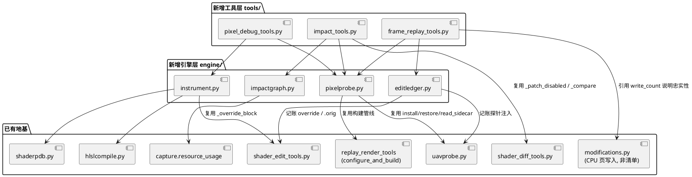
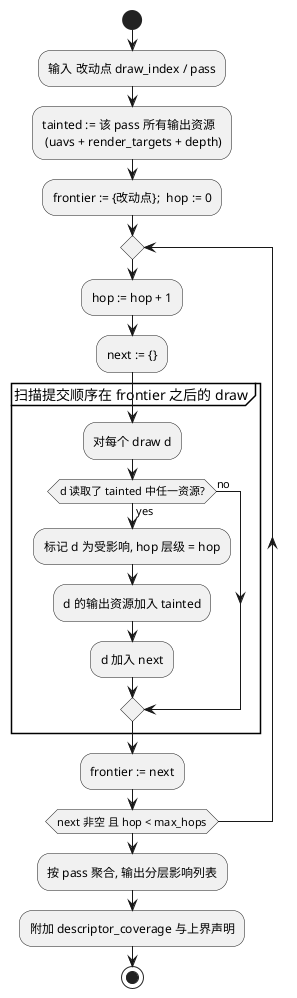

# 像素级调试、跨 Pass 影响追踪与整帧重放 —— 设计文档

> 状态：设计草案，**已过对抗性审查（见 §十一），审查结论为不完备，含 1 条致命缺陷**
> 日期：2026-08-10（第三版：第二版补入能力 C；第三版补入 §十一 对抗性审查与修正方案）
> ⚠️ **阅读提示**：§一~§十 为原始设计，其中 §6.6 的 `--at` 默认值与 §八 的实施顺序
> **已被 §十一 取代**。实现前必须先读 §十一，尤其 D1（补丁作用域是 PSO 而非 shader）。
> 范围：为 `pix-tool-set` 补齐三项共用同一套地基的能力 ——
> (A) PIX GUI 式的像素调试（pixel debug）；
> (B) 修改中间 pass 后的下游影响追踪（downstream impact）；
> (C) 整帧重放取全量资源 + 修改集管理与 reset（full-frame replay & reset）。
>
> 合并成一份文档的理由：三者共用同一套地基。像素调试要做到"观测而不改变"，
> 依赖的正是影响追踪里的**旁路 UAV 观测**机制；影响追踪要判断"下游变化是否可信"，
> 依赖的正是像素调试里的**逐检查点回读**机制；而能力 C 的全量 dump 与前两者
> 共用**同一个探针注入 / 还原 / sidecar 回读**链路。分开设计必然把同一套基建实现三遍。

---

## 一、问题陈述

### 1.1 现状：有"像素"工具，但没有 pixel debug

| 工具 | 实际做的事 | 与 GUI pixel debug 的差距 |
|------|-----------|--------------------------|
| `debug-pixel-shader` | 拼装 PS 反汇编 + 声明寄存器 + 绑定 SRV/RT | 无任何运行期值；工具 notes 已自陈"live register values 只能在 PIX replay session 内" |
| `pixel-history` | `viewport`/`scissor` 覆盖 + RT 绑定筛选，`method: static-coverage-analysis` | 不做三角形覆盖、深度/模板测试、背面剔除；给的是"可能写过"的候选集，不是实际 fragment 列表，也没有每步的写入值 |
| `sample-pixel-region` | 导出 RT 后统计区域通道均值/直方图 | 只是结果快照 |
| `read-replay-target` | 回放到 DDS 并按原格式解码真实数值 | 真实值，但 pixtool 采样点在事件**执行之前**；且是整面资源，不是某个 fragment 的计算过程 |

**结论**：现有能力覆盖"结果值"和"静态候选集"，完全缺失"计算过程"。

### 1.2 现状：改中间 pass 后无法界定影响面

改一个中间 pass 的 shader 后下游全变，**这是补丁生效的证据，不是缺陷**。PIX GUI 的 Apply
同样是从被改事件重放到帧尾。真正的问题是三个：

1. 无法区分"我想看的变化"与"顺带被冲刷的变化"；
2. 无法知道传播边界在哪里（传到哪一步就衰减/被覆盖了）；
3. 无法在不污染下游的前提下做观测。

现有工具里 `resource-usage` 只做单资源单跳读写列表，`pipeline-state` 的 `consumers`
只是"共用同一 PSO 的 draw"，都不构成传播闭包。`shader-edit-diff` 一次构建服务两次回放，
但观察点只有一个。

### 1.3 现状：整帧重放已经在跑，缺的是全量 dump 与统一 reset

**这一节修正了本文档第一版的一个偏向**：第一版把"下游被污染"一律当作要规避的问题，
那只适用于"验证补丁是否生效"这一个场景。存在另一个同等重要的场景：
**污染本身就是产物** —— 改一个中间 pass，就是想看整帧所有下游资源的新形态。
两个诉求方向相反，必须分成不同工具，不能共用一个默认行为。

机制上"改一个 pass 后完整跑一遍整帧"**已经在发生**：`export-to-cpp` 产出的
`RenderFrame.cpp` 按录制顺序提交所有命令列表，`shader-edit-apply` 的 override 只是换掉
某个 PSO 的字节码，整帧照旧跑完。缺的是两件事：

1. 没有工具把所有（或指定集合的）资源从这次重放里捞出来；
2. 没有统一的、可枚举的、可校验的 **reset** 入口。还原逻辑目前散落在三处各管一摊 ——
   `shader_edit_tools._patch_export` 自己备份 `CreatePSOs.cpp.orig` 与 `Helpers.h.orig`，
   `uavprobe.restore()` 自己还原 `RenderFrame.cpp` / `CMakeLists.txt` 并删探针源，
   `shader_diff_tools._patch_disabled` 用改名做临时禁用。没有任何一方知道另外两方改了什么。

### 1.4 已有的历史教训（直接决定本设计的若干硬约束）

- **教训 1**：`visibly_different: false` 曾被误读成"补丁没生效"，真因是回放窗口是 Slate UI、
  3D 视口全黑。→ **验证补丁是否生效时必须读直接输出，不读最终画面**。
- **教训 2**：`already_patched` 的 raise 位于 `.dxil` 写盘之前，导致补丁被拒时旧 dxil 留在盘上，
  被连环误判为"CMake 增量构建没拾取变化"和"HLSL 编译器优化/精度问题"，白烧两次 160~200s 构建。
  → **任何"结果没变"的结论，必须先证明补丁真的落地了**。
- **教训 3**：资源 3032 曾被误判"无人消费"，真因是 `ModifyDescriptors_*.cpp` 没被解析。
  → **凡基于 `resource_usage` 的推断，必须挂 `descriptor_coverage`，"无数据"不能表述成"无影响"**。
- **教训 4**：全程未用 `shader-edit-diff`，手工重复 before/after，是当时最大的时间浪费。
  → **新工具必须一次构建服务多次观测，且默认走编排而非手工**。
- **教训 5**：只读初始 upload blob 会拿到过期字节，一个 uint 字段读出 `1065353216`
  （即 float `1.0f`）才暴露问题，真因是漏掉了帧内 CPU 页写入。
  → **凡声称"资源的真实内容"，必须是 initial upload + 帧内页写入的合并结果**（见 §2 的
  `engine/modifications.py`）。

---

## 二、可复用地基（不需要新建的部分）

设计的关键判断是：**缺的不是基础设施，而是上层编排**。已经就绪的积木：

- `export-to-cpp` 产出可编译的 CMake 回放工程（`cmake -S -B -G <gen> -A x64` +
  `--build --config Release --parallel`），`RenderFrame.cpp` 即整帧重放入口。
- `engine/shaderpdb.py`：从引擎 shader PDB 恢复预处理后 HLSL **及原始编译参数**。
- `engine/hlslcompile.py`：`IDxcCompiler3` 主路径 + `dxc.exe` 回退，`dxil.dll` 真实签名。
- `tools/shader_edit_tools.py`：`_override_block` / `_override_pattern` 把任意阶段字节码重定向到侧文件；
  `_STAGES` 来自 `ShaderStage` 全集，**PS 与 CS 同等支持**（生成 `pssDesc.PS = {...}`）；
  改写前 `shutil.copy2` 备份 `CreatePSOs.cpp.orig`，`_ensure_reader_helper` 另备份 `Helpers.h.orig`。
- `engine/uavprobe.py`：`install` / `restore` / `is_installed` / `read_sidecar` / `depad` /
  `as_image` / `statistics` / `sample_pixels` / `to_rgb_png` / `summarise_probe_log`，
  含 `.orig` 备份、`.done` sentinel、CMake 显式源列表插入、幂等安装（第二次跳过重建）、
  失败时回滚已改文件不留半成品。`ProbeDump` 与 sidecar 已是"一资源一份"结构，
  探针内部 `targets` 本就是列表（`requested=targets.size()`），**批量化是自然扩展而非重写**。
- `tools/shader_diff_tools.py`：`_patch_disabled` 是 `@contextmanager`，实现"一次构建两次回放"，
  `_compare` / `_side_by_side` / `_channel_table` 产出量化差异与并排图。
- `tools/replay_render_tools.py`：`export_root` / `configure_and_build` / `supply_winpixruntime`
  三个公开别名（内部 `_export_root` / `_configure_and_build` / `_supply_winpixruntime`），
  已被 uavprobe 复用，能力 C 直接沿用同一构建管线。
- `engine/capture.py`：`resource_usage`（每资源的 `read_draws` / `write_draws` /
  `render_target_draws` / `depth_draws` / `passes`）与 `descriptor_coverage`。
- `tools/_common.py`：`DRAW_SELECTOR` / `PASS_SELECTOR` / `resolve_draw` / `resolve_pass` / `pass_identity`。

### 2.1 `engine/modifications.py` 不是修改集清单（重要澄清）

一次命名撞车，必须在设计阶段就说清，否则后续实现会误用：

`engine/modifications.py` 与 shader 编辑**毫无关系**。它解析 `ResourceModifications_*.cpp`
与 `RenderFrameWorker_*.cpp`，重建 PIX 录制的**每帧 CPU 页写入**（4 KB 页粒度），
产出 `ModificationPlan{writes: dict[resource_id, list[PageWrite]], blob_sizes}`，
其中 `PageWrite(resource_id, page, blob_index, blob_offset, size=4096)`。
存在理由正是 §1.4 教训 5：UE5 帧内 CPU 会更新 upload buffer，只读初始 blob 拿到的是过期字节。

由此得到两条结论：

1. **修改集清单必须新建模块，且绝不能叫 `modifications.py`**。本文档统一称
   `engine/editledger.py`（编辑记账簿），语义与 `modifications.py` 无重叠。
2. **附带价值**：`modifications.py` 的存在恰好证明导出工程的整帧重放是**忠实**的 ——
   它会重放这些 CPU 页写入，所以能力 C dump 出来的资源内容是
   `initial upload + 帧内页写入` 的合并结果，与录制一致，cbuffer 类资源同样可信。
   全量 dump 的报告应引用 `ModificationPlan.write_count` 说明这一点。

---

## 三、总体架构



**分层原则**：`engine/` 只做机制，不认识 CLI 参数；`tools/` 只做编排与信封，
选择器一律复用 `_common.py`，不自己手写 resolve + not_found。

---

## 四、能力 A：像素调试

### 4.1 路线选择

不做 DXIL 解释器。选 **shader instrumentation + debug UAV trace buffer**：
把 GUI 的"逐指令看寄存器"翻译成"在目标像素处把中间量写入 buffer，回读后重建轨迹"。

理由：解释器要重新实现完整 DXIL 语义 + 纹理采样 + 资源状态，工作量与风险都远高于插桩，
而插桩能直接复用已有的 PDB→HLSL→dxc→override→回读整条链路。

### 4.2 trace 宏

```hlsl
// 由 instrument.py 注入到预处理后 HLSL 顶部
RWByteAddressBuffer g_pixtsTrace : register(u7);   // 槽位由空闲槽扫描决定
static uint2 g_pixtsTarget = uint2(PIXTS_TARGET_X, PIXTS_TARGET_Y);

#define PIXTS_TRACE(slot, v)                                              \
  if (all(uint2(input.SV_Position.xy) == g_pixtsTarget)) {                \
      uint at;                                                            \
      g_pixtsTrace.InterlockedAdd(0, PIXTS_REC_BYTES, at);                \
      g_pixtsTrace.Store (at + 4,  slot);                                 \
      g_pixtsTrace.Store (at + 8,  PIXTS_FRAGMENT_KEY);                   \
      g_pixtsTrace.Store4(at + 16, asuint(float4(v)));                    \
  }
```

- 偏移 0 是原子分配游标，记录区从 `PIXTS_REC_BYTES` 起。
- `PIXTS_FRAGMENT_KEY` 打包 `SV_PrimitiveID` + `SV_SampleIndex` +（可得时）instance id。
- `asuint(float4(v))` 统一按 4 分量存，标量/2/3 分量补零，读回时按记录的声明类型裁剪。
- 溢出保护：游标超过 buffer 容量时停止写入，并在回读时按 `cursor > capacity` 报 `trace_overflow`。

### 4.3 UAV 槽位获取（最大障碍）

root signature 来自录制，不能随意扩。按风险从低到高：

1. **复用空闲槽**（首选）：root signature 声明了但 shader 未使用的 UAV 槽。
   UE5 常声明 16 槽只用 8，此前已实测确认。由 `pass-bindings` 的 table 展开结果判定空闲。
2. **借用尾部区域**：占用某个已绑定 UAV 的尾部字节。侵入性中等，且会污染该资源，
   仅在方案 1 无槽可用且该 UAV 确认为纯写不读时使用。
3. **重建 root signature**：风险最高（要同步改 PSO 创建与所有 `SetGraphicsRootDescriptorTable`
   的参数索引），放最后，默认不启用，需 `--allow-rootsig-rebuild` 显式开启。

槽位决策必须写进返回体的 `slot_strategy` 字段，并说明是否污染了别的资源。

### 4.4 分阶段落地

| 阶段 | 工具 | 机制 | 是否改 shader | 风险 |
|------|------|------|--------------|------|
| **P0** | `pixel-value-history` | 1×1 scissor + 逐候选 draw 后把该像素 copy 到 readback 数组 | 否 | 低 |
| **P1** | `pixel-trace`（手工） | 用户在 `shader-edit-begin` 拿到的 HLSL 里自己插 `PIXTS_TRACE` | 是（用户手写） | 中 |
| **P2** | `pixel-trace --auto` | 源码级自动插桩：按赋值语句与分支节点自动布点 | 是（自动） | 中高 |
| **P3** | DXIL 解释器 | —— | 否 | 高，暂不做 |

**P0 是真正补齐 GUI 那张历史表的一步，且不需要改 shader**，应最先做。
它把 `pixel-history` 的静态候选集变成带真实值的实际写入序列：对每个候选 draw 后插入
一次 1 像素 copy，回读后即得"第几个 draw 把这个像素改成了什么"。深度/模板/覆盖测试
由 GPU 自己完成，不需要我们模拟 —— **值没变就说明该 fragment 没通过测试或被 blend 吃掉**。

### 4.5 新增工具签名

```
pixel-value-history   category=advanced
  --x --y  (required)
  --resource-id | --rtv        观察的目标
  --draw-index / --queue-id / --pass-name   起止范围（复用 DRAW_SELECTOR）
  --max-checkpoints            默认 64，防止回放期爆炸
  --settle-seconds             默认沿用 240（见 §8 待办）
  → 返回：按提交顺序的 [{draw_index, pass_name, value, changed, delta}]

pixel-trace           category=advanced
  --x --y  (required)
  --draw-index / --queue-id / --pass-name
  --stage                      默认 PS，允许 CS（此时 --x --y 解释为 thread id）
  --auto                       自动插桩
  --slots                      手工模式下声明期望的 slot 数
  --allow-rootsig-rebuild      默认 false
  → 返回：[{fragment_key, records: [{slot, source_line, expr, value}]}]
```

---

## 五、能力 B：跨 Pass 影响追踪

### 5.1 四种策略与适用场景（表述已修正）

**前提修正**：污染下游本身没有对错，取决于当前问的是哪个问题。

- 问"补丁生效了吗" → 污染是噪声，用 S1 把观察点前置。
- 问"改完之后整帧变成什么样" → 污染就是产物，走**能力 C**（§六）。
- 问"影响传到哪里为止" → 用 S2 + S3 量化边界。

| 策略 | 做法 | 何时用 | 现状 |
|------|------|--------|------|
| **S1 观察点前置** | 只读被改 pass 的直接输出，不看最终画面 | **验证补丁是否生效**（此场景下的默认纪律） | 已支持（`read-uav` / `read-replay-target`） |
| **S2 先算影响集** | 从改动点做资源读写传递闭包，得到污染前沿 | 决定"值不值得看最终画面"、划定 dump/检查点范围 | 缺 `trace-downstream` |
| **S3 逐检查点 diff** | 一次构建，两次回放，多个观察点 | 回答"传播到哪里衰减了" | 缺，扩 `shader-edit-diff` |
| **S4 污染隔离** | 调试写入引到旁路 UAV，不覆盖原输出 | 需要对比最终画面时 | 缺，与 §4.3 共用槽位机制 |

**S1 是纪律而非工具**：此前 18704 的实测正是这个模式 —— 回读 `RWNormalTexture` 得到
"1170448/1170448 像素改动、均值 (127.0,214.3,167.7) → (127.5,127.5,0)"的确定结论，
全程不关心下游。这条纪律应写进 skill 文档，**并注明它只约束"验证生效"场景**。

### 5.2 `trace-downstream` 算法



关键实现点：

- 数据源是 `capture.resource_usage`，已有 `read_draws` / `write_draws` / `render_target_draws`。
- **必须按提交顺序过滤**：只有 `draw.index` 大于污染源的读取才算受影响。多队列下需按队列
  归属分别判断，异步计算队列的 `queue_id` 可能为 null，此时以 `draw_index` 为准。
- **clear / copy 会截断传播**：某资源被后续 `ClearRenderTargetView` 或整面 copy 覆盖后，
  应从 `tainted` 中移除。这是降低高估最重要的一步。
- 输出必须区分 `render_target` / `srv` / `depth` 三种传播路径，因为深度传播往往
  只影响可见性而不改变颜色计算。

### 5.3 `shader-edit-diff --checkpoints`

现有结构极适合扩展：`_patch_disabled` 已是 `@contextmanager`，一次构建内已服务
patched / original 两次回放。改动是把"单个 dump 目标"换成"检查点列表"：

```
shader-edit-diff --queue-id <改动点> --checkpoints auto|<id列表>
  auto = trace-downstream 的每层取代表性 pass（默认每层 1 个，上限 8 个）
  → 返回：每个检查点的 BEFORE/AFTER/DIFF 图 + 量化差异
  → 额外返回：差异幅度随 hop 递进的衰减曲线
```

这条**衰减曲线**才是回答"传播到哪里就无关紧要了"的东西：某检查点差异比例跌到
噪声水平以下，即为实际传播边界（区别于静态闭包给出的理论上界）。

### 5.4 新增工具签名

```
trace-downstream      category=advanced
  --draw-index / --queue-id / --pass-name   (复用 DRAW_SELECTOR/PASS_SELECTOR)
  --max-hops           默认 8
  --include-depth      默认 true
  --stop-at-clear      默认 true
  → 返回：{tainted_resources, affected: [{hop, pass_name, draw_indices, via}],
           frontier, truncated, coverage}
```

纯静态分析，无需回放，成本最低。

---

## 六、能力 C：整帧重放取全量资源 + 修改集管理与 reset

### 6.1 结论：可行，且比能力 A 简单

整帧重放**已经在跑**（§1.3）。所以这项能力不需要新机制，只需要三件缺失的编排：
批量 dump、修改集记账、统一 reset。

### 6.2 与 RenderDoc 机制的差异（决定 reset 的实现难度）

| 维度 | RenderDoc | pix-tool-set |
|------|-----------|--------------|
| 替换单位 | 内存中的资源 ID 映射（`ReplaceResource(from, to)`） | 导出工程源码里的 override 块 + 侧文件 dxil |
| 编译入口 | `BuildTargetShader(encoding, source, entry, flags, stage)` | `hlslcompile` 调 `IDxcCompiler3` / `dxc.exe`，`dxil.dll` 签名 |
| 撤销 | `RemoveReplacement(id)` + `ClearReplayCache`，指针拨回，O(1) 瞬时 | 文件系统状态回滚：还原 `.orig`、删 `edited_*.dxil`、移除探针 |
| 撤销触发 | 编辑窗口一关自动还原（生命周期绑定 UI） | 无自动触发，必须显式调用 |
| 原件是否活着 | 是，原 shader 对象一直在内存里 | 是，但以 `.orig` 备份与"override 为空则回退原字节码"两种形式 |
| 跨进程存活 | 否，关掉即失 | 是，可版本控制、可脚本化 |

我们更接近 RenderDoc 的 `BuildTargetShader` + 文件持久化，**没有** `ReplaceResource` 那层
内存映射。好处是可脚本化、可复现、可提交；代价是 reset 从"指针拨回"退化成"文件状态回滚"，
因此**必须显式记账**——RenderDoc 靠内存映射表天然知道改了什么，我们不记就不知道。

### 6.3 三件缺的东西

**(1) `frame-replay-dump`** —— 跑一次整帧，把指定集合的资源全部 dump 出来。
不是新机制，是把 uavprobe 的单资源探针扩成多资源批量探针（`ProbeDump` 与 sidecar
已是"一资源一份"结构，`targets` 本就是列表）。

**(2) `engine/editledger.py`** —— 修改集清单，reset 可靠的前提。落盘为
`<export_dir>/.pixts-edits.json`：

```json
{
  "schema": 1,
  "export_dir": "G:/...pixcache/cpp",
  "entries": [
    {"kind": "shader_override", "pso_id": 3255, "function": "CreatePipelineState_3255",
     "stage": "CS", "payload": "edited_CreatePipelineState_3255_CS.dxil",
     "original_shader_hash": "5f118A90...", "patched_shader_hash": "a13c...",
     "touched_files": ["CreatePSOs.cpp"], "backups": ["CreatePSOs.cpp.orig"],
     "applied_at": "2026-08-10T14:22:03Z"},
    {"kind": "probe", "probe": "PixToolSetProbe.cpp",
     "touched_files": ["RenderFrame.cpp", "CMakeLists.txt"],
     "backups": ["RenderFrame.cpp.orig", "CMakeLists.txt.orig"]}
  ]
}
```

记账必须由 `shader_edit_tools._patch_export` 与 `uavprobe.install` **在改文件的同一处**
写入（同教训 2 的次序纪律：先记账再改文件，账目宁可多记不可漏记；漏记会导致 reset
留下无人认领的修改）。

**(3) `replay-reset`** —— 按 ledger 逐条撤销，并**校验**回到干净状态。

### 6.4 reset 的两级

| 级别 | 做法 | 是否需要重新构建 | 用途 |
|------|------|-----------------|------|
| `--soft`（默认） | 删除 / 改名 `edited_*.dxil`，重启 exe | **否** | 快速在原始/修改版之间切换 |
| `--hard` | 还原所有 `.orig`、删 override 块与探针源、恢复 CMakeLists，再重新构建 | 是 | 真正把导出工程交还给用户 |

`--soft` 之所以成立：override 是运行时 `ReadFileBytes` + `static` 变量，dxil 缺失即回退
原字节码，所以换 dxil 只需重启 exe，不需重编译。此前"删 exe + obj 强制重建"白烧两次
160~200s 构建，就是没意识到这一点。

**校验是必须项**：`--hard` 完成后必须确认 `CreatePSOs.cpp` / `RenderFrame.cpp` /
`Helpers.h` 中已无任何 `pix-tool-set` marker 且无残留 `.orig`，否则报
`reset_incomplete` 并列出残留项。`--dry-run` 必须支持，先列出将撤销什么。

**已知不干净的历史状态**：`.dxil` 可能因旧版本行为残留在盘上；ledger 建立之前打的补丁
不在账内。因此 `replay-reset` 需要一个 `--scan` 模式：不依赖 ledger，直接按 marker 与
`.orig` / `edited_*.dxil` 的文件模式全盘扫描，用于收拾历史遗留。

### 6.5 dump 目标怎么选（"全部资源"是个陷阱）

整帧有几千个资源，全量 dump 是 GB 级、几十分钟。而且两条硬边界已实测确认：

- `pixtool save-resource` **只能导出绑定的 Render Target**，compute-only UAV 一律失败（PIXTOOL9）；
- 它采样的是事件**执行之前**的内容。

所以全量 dump **必须走探针路线**（在 `RenderFrame()` 内 copy 到 readback），
不能走 pixtool。目标集合按优先级：

1. `--from-impact`：用 `trace-downstream` 算出的受影响集合（**推荐默认**，
   这也是能力 B 的第一个真实用途）；
2. `--resource-ids` 显式列表；
3. `--all-render-targets`：所有被当作 RT/DSV 用过的资源；
4. `--all`：需显式确认，并先报出预估字节数与耗时，超过 `--budget-bytes` 直接拒绝。

### 6.6 新增工具签名

```
frame-replay-dump     category=export
  --from-impact <draw/queue/pass> | --resource-ids <ids> | --all-render-targets | --all
  --at                        ⚠️ 默认值已由 §十一 D2 更正为 last-read
                              （原写 frame-end，因资源别名而不可靠）
  --output <dir>
  --budget-bytes              默认 8GiB，超出即拒绝
  --format                    bin+sidecar（默认）| png | dds
  --keep-probe                保留探针跳过下次构建
  → 返回：{dumped: [{resource_id, path, layout, statistics}], skipped: [...],
           replay: {build_seconds, settle_seconds, exe_path},
           fidelity: {cpu_page_writes_replayed: <ModificationPlan.write_count>}}

replay-reset          category=session
  --soft | --hard             默认 --soft
  --dry-run                   只列出将撤销什么
  --scan                      不依赖 ledger，按 marker/文件模式全盘扫描
  → 返回：{reverted: [...], removed: [...], rebuilt: bool,
           verified_clean: bool, leftovers: [...]}

replay-edits          category=session
  → 返回：当前 ledger 内容（当前生效的修改集清单）
```

---

## 七、必须提前想清楚的坑

### 7.1 像素调试

- **overdraw 分组**：同一像素可能被多个 fragment 命中，记录必须带
  `SV_PrimitiveID` / `SV_SampleIndex` / instance id 才能分组，否则多个 fragment 混成一团。
  这正对应 GUI 里"选择哪个 fragment"那一步。`InterlockedAdd` 只保证槽位不冲突，
  **fragment 之间无序**；同一 fragment 内靠 slot 编号排序。
- **值的语义**：`-O3` 下插桩点与原始 DXIL 寄存器不是一一对应。写 UAV 有副作用不会被消除，
  但值可能已被合并折叠。报告必须标注"值来自源码级插桩点，不等价于原始 DXIL 寄存器"。
- **无记录 ≠ 记录为 0**：分支未走到的插桩点不会有记录，这本身是有用信息，
  但两者在返回体里必须能区分（用 `present: false` 而非 `value: 0`）。
- **wave intrinsics 失真**：插桩引入额外 divergence 会影响 `WaveActiveSum` 等结果，
  检测到目标 shader 使用 wave intrinsics 时必须主动告警。
- **存在性预检（来自教训 2）**：全量插桩前先跑一次只写 flag 的探测，确认目标像素
  真被这个 PSO 的 PS 命中。否则拿到空结果时会重复"补丁没生效/编译器优化"那类错误归因。

### 7.2 影响追踪

- **静态闭包是上界**：不判断读到的区域是否与改动区域重叠，不判断值是否真的传下去
  （可能被 clear 覆盖、被分支绕过、被 blend 权重压到不可见）。返回体必须自称
  `"bound": "upper"`，用途是划定 dump / diff 范围，**不能当作"确实变了"的结论**。
- **descriptor_coverage 强制挂载（来自教训 3）**：覆盖率不足时"下游没人读"与
  "数据没解析出来"长得一模一样，必须 degrade 而非静默返回空列表。
- **补丁落地校验（来自教训 2）**：所有 diff 类结论前置检查 `hash_changed` /
  `previous_shader_hash`，未落地直接报错，不进入回放。

### 7.3 整帧重放与 reset

- **reset ≠ 恢复到能出正确画面**：构建产物（`build/Release/*.exe`）仍是打了补丁的那个。
  `--soft` 靠删 dxil + 重启 exe 生效，`--hard` 必须重新构建后才算真正干净。
  返回体要分别报 `sources_clean` 与 `binary_clean`，不能合成一个 `clean`。
- **exe 定位启发式风险**：现有实现取 `build/Release/*.exe` 中最大者（`--skip-build` 路径同样如此），
  多 dump / 多检查点场景下若产生多个 exe 会选错。应改为记录构建产物路径写入 ledger。
- **ledger 与文件系统可能不一致**：用户手工改过导出工程、或用旧版本打过补丁。
  因此 ledger 只是加速路径，`--scan` 必须能独立工作；两者结果不一致时以文件系统为准并报 warning。
- **并发安全**：ledger 是单文件 JSON，多个工具同时 patch 会互相覆盖。
  先用"读-改-写 + 文件锁"最简实现，并在 schema 里留 `schema: 1` 便于升级。
- **忠实性声明（来自教训 5）**：dump 报告必须引用 `ModificationPlan.write_count`，
  明示资源内容包含帧内 CPU 页写入，而非仅 initial upload。
- **`--settle-seconds` 自适应**：默认 240 在 2.3 GB capture 上实测吃满；批量 dump 会显著
  拉长回放，必须按 capture 字节数自适应（原低优先级待办，本轮升为必做）。

---

## 八、实施顺序与工作量

> ⚠️ **本节的顺序已被 §11.6 取代**。原顺序把优化项（`trace-downstream`）排在正确性项之前，
> 对抗性审查判定为错误排序。本节保留作为演进记录，**实现请以 §11.6 为准**。

| 顺序 | 交付物 | 依赖 | 理由 |
|------|--------|------|------|
| 1 | `trace-downstream` | 无（纯静态） | 成本最低；既回答"要不要看最终画面"，又为 `frame-replay-dump --from-impact` 与 `--checkpoints auto` 提供输入 |
| 2 | `engine/editledger.py` + `replay-edits` + `replay-reset` | 无 | **安全网优先**：先有可靠 reset，后面所有会改导出工程的实验才敢放手做 |
| 3 | `pixel-value-history`（P0） | 1 | 直接补齐 GUI 历史表，不改 shader，风险最低 |
| 4 | `frame-replay-dump` | 1、2 | 批量探针，用户主诉求；与 P0 共用探针改造 |
| 5 | `shader-edit-diff --checkpoints` | 1、4 | 复用现有构建，改动集中在 dump 目标列表化 |
| 6 | `engine/pixelprobe.py` + `pixel-trace`（P1 手工） | 3、4、5 | 与 S4 旁路 UAV **共用槽位与探针机制，合并实现** |
| 7 | `pixel-trace --auto`（P2） | 6 | 源码级改写，最需要打磨 |
| — | DXIL 解释器（P3） | —— | 暂不排期 |

**顺序相对第一版的调整**：`editledger` + `replay-reset` 从"没有"提到第 2 位。
理由是它是**安全网**：能力 C 会频繁改导出工程，没有可靠 reset 就会不断积累无人认领的
修改，而这正是教训 2 那类连环误判的温床。

**明确的合并点**：
- S4 污染隔离的旁路 UAV 与 pixel debug 的 trace buffer 是同一个机制（都要空闲槽位、
  原子游标、sidecar 回读），第 6 步一次做完；
- `frame-replay-dump` 的批量探针与 `pixel-value-history` 的 1×1 copy 探针共用
  `pixelprobe` 的注入 / 还原 / sidecar 三段式，不要各写一份。

**顺带修掉的既有待办**：
- `--settle-seconds` 按 capture 字节数自适应（批量 dump 会放大，见 §7.3）。
- `export-uav-slice` 全 0 且 `is_uav` 时，diagnostics 直接给出可执行的 `read-uav` 命令。
- `--name` 多候选时用 descriptor 绑定表自动收敛。
- exe 路径由"取最大文件"改为构建时记录（见 §7.3）。

---

## 九、验证计划

沿用既有 `tests/verify_*.py` 体例，新增：

- `verify_trace_downstream.py`：闭包正确性（构造已知链路）、clear 截断、多队列顺序、
  `max_hops` 截断、coverage 不足时必须 degrade。
- `verify_edit_ledger.py`：patch 后账目齐全（对比文件系统 marker 扫描结果，
  **账目必须是实际修改的超集，缺项即为漏记 bug**）、并发写不丢条目、schema 兼容。
- `verify_replay_reset.py`：`--dry-run` 不改任何文件；`--soft` 后 dxil 消失但 `.orig` 仍在；
  `--hard` 后无 marker 无 `.orig`；`--scan` 能在删掉 ledger 后仍收拾干净；
  `sources_clean` 与 `binary_clean` 分别正确；残留时必须报 `reset_incomplete`。
- `verify_pixel_value_history.py`：与 `pixel-history` 静态候选集的交叉校验
  （实际写入必须是候选集的子集，**若出现超集即为覆盖判定有 bug**）。
- `verify_frame_replay_dump.py`：`--budget-bytes` 超限必须拒绝而非硬跑；
  compute-only UAV 走探针成功（对照 pixtool 路径必然失败）；
  sidecar 的 `row_pitch != row_size` 时 depad 正确；`fidelity.cpu_page_writes_replayed` 非零。
- `verify_pixel_trace.py`：overdraw 分组、`present: false` 与 `value: 0` 可区分、
  trace 溢出报错、wave intrinsics 告警、存在性预检生效。
- `verify_checkpoint_diff.py`：一次构建服务 N 次回放（断言构建只发生一次）、
  异常时补丁不残留在禁用状态（沿用现有 try/finally 纪律）。

同时更新 `tests/check_coverage.py` 的需求映射表；把 §5.1 修正后的场景分流表
（"验证生效"用 S1、"看整帧新形态"走能力 C）与 `replay-reset` 的两级语义写进
`skills/pix-shader-hotswap/SKILL.md` 的决策表。

---

## 十、需要评审确认的开放问题

1. `pixel-value-history` 的 1×1 copy 插入点：走 `RenderFrame.cpp` 探针注入（与 uavprobe 同构），
   还是逐检查点独立回放？前者一次构建搞定但要改录制的命令流，后者干净但 N 次回放成本高。
2. UAV 槽位方案 2（借用已绑定 UAV 尾部）是否允许默认启用？它会污染一个真实资源。
3. `--auto` 插桩的布点密度上限：全量布点在复杂 UE5 材质 PS 上可能产生数百个 slot，
   是否需要按源码行范围 `--lines` 限定。
4. `frame-replay-dump --at` 是否需要支持多个时机点（帧尾 + 若干 draw 后）？
   多时机会让探针注入点从 1 处变成 N 处，复杂度显著上升。
5. ledger 是否应随 session 一起存进 `sessions.json`（`SessionRecord` 加字段），
   还是独立放在 export_dir 下？独立放的好处是跟着工程走、可提交；放 session 的好处是
   `session-info` 能一并汇报当前生效的修改集。
6. DXIL 解释器（P3）是否需要保留在路线图里，或明确放弃。

---

## 十一、对抗性审查（2026-08-10）

审查命题：**「改一个 shader → 整帧渲染结果统一改变 → 可完整复原」这条链路，
按 §一~§十 的设计是否完备？**

审查结论：**不完备。** 发现 5 条缺陷，其中 D1 为致命级 —— 它会让"统一改变"这个前提
直接失效，且失败形态酷似成功。D1、D2 属**正确性**问题（数据是错的），
D3、D4 属**可复原性**问题，D5 属**可信性**问题（无法判断结果对不对）。

以下每条给出：攻击、证据、后果、解决方案。**本章不含任何代码改动，仅为设计定案。**

### D1【致命 · 已实测确证】补丁作用域是 PSO，不是 shader

**攻击**：命题要求"改一个 shader"，但实现改的是"一个 PSO 的一个 stage"。
UE5 中同一份 shader 字节码会被**几十个 PSO** 引用（blend / depth / RT 格式组合不同，
shader 相同）。只 patch 其中一个，整帧就是**部分改变**。

**证据**：
- `shader_edit_tools._patch_export` 定位单位写死为 `function = f"CreatePipelineState_{draw.pso_id}"`，
  payload 为 `edited_{function}_{stage}.dxil` —— 每个 PSO 一份，互不影响。
- `shader_tools.shader_info` 的 `consumers` 判据是 `draw.pso_id == shader.pso_id`，
  只枚举**同一 PSO** 的 draw，不枚举同一 shader 的其他 PSO。
- `capture` 侧只有 `find_shaders(shader_hash=...)` 做模糊查找（`capture.py` L972-999），
  **没有 `shader_hash → [pso_id]` 的反向分组索引**。
- 对照 RenderDoc：`ReplaceResource(from, to)` 替换的是资源 ID，官方 tip #11 明确写
  "The shader will be replaced **everywhere it is used** in the frame"。我们没有这层映射。

**后果（最危险的部分）**：失败形态**酷似成功**。直接输出确实变了（被 patch 的那个 PSO
真的生效），`hash_changed` 为 true，`--force` 校验全过。只有下游会出现无法解释的
不一致（同一材质有的像素变了有的没变）。这正是教训 2 那类连环误判的完美温床 ——
人会转而怀疑编译器优化、精度、增量构建，而真因在作用域。

**解决方案**：

1. `engine/capture.py` 新增反向索引 `shader_pso_index`（`cached_property`）：
   `{(stage, shader_hash): [pso_id, ...]}`。key 必须含 stage —— 同一 hash 理论上只属一个
   stage，但 UE5 有 VS/PS 共用 hash 的边界情形，带上 stage 更安全。
2. `shader-edit-apply` 新增 `--scope` 参数，三值且**必须显式**：
   - `pso`（当前行为）：只改选中的 PSO。仅用于定点实验。
   - `shader`（**能力 C 的必需值**）：改所有引用同一 `(stage, shader_hash)` 的 PSO。
   - `auto`：`shader_pso_index` 命中 1 个 PSO 时等价于 `pso`，命中多个时**报错**并列出
     全部 pso_id，要求调用方显式选择。
3. **默认值定为 `auto`，不是 `pso`** —— 让"沉默的部分改变"变成一个必须回答的问题。
   这是本条缺陷的核心防线：宁可打断流程，不可静默产出错数据。
4. `shader-info` 增加 `sibling_psos` 字段（同 hash 的其他 PSO 列表）与
   `patch_scope_warning`：`len(sibling_psos) > 1` 时主动告警。
5. ledger 记账单位随之变化：一次 `--scope shader` 的 patch 产生**一条 group 记录 +
   N 条 PSO 子记录**，reset 必须按 group 整体撤销，不允许只回滚一半。
6. `frame-replay-dump` 前置门禁：检测到 ledger 中存在 `scope: pso` 且该 shader 有
   sibling PSO 未被 patch 时，**拒绝出报告**，报 `partial_shader_scope`。

**回溯核实（2026-08-10 已完成，实测数据）**：

针对 18704 / `StochasticLightingTileClassificationMarkCS`（hash `f3dddac6e04484977a815ca5bd84f78a`）
在 `Tiled.wpix` 上实测：

```
pixts list-shaders --session Tiled --name f3dddac6e04484977a815ca5bd84f78a
  → total: 1，唯一条目 CS / pso_id 3255
```

**结论：该 shader 在本 capture 中只被 PSO 3255 引用，此前"100% 像素改动、
均值 (127.0,214.3,167.7) → (127.5,127.5,0)"的实测结论不受 D1 影响，完全成立。**

但同一次核实证明 **D1 在本 capture 中是真实存在的普遍问题，不是理论推测**：

```
list-shaders           total = 363   （shader 条目 = PSO×stage 实例）
list-shaders --unique  total = 316   （按 stage+hash 去重）
差值 47 = 被多个 PSO 复用的 shader 实例数
```

按 `key`（`stage:hash`）分组后的复用分布：

| 每 shader 的 PSO 数 | shader 个数 | 说明 |
|---|---|---|
| 1 | 298 | 单 PSO，`--scope pso` 与 `shader` 等价 |
| 2 | 12 | |
| 4 | 1 | |
| 6 | 3 | |
| 7 | 1 | |
| 12 | 1 | **最严重**：`VS:230e0143b0648e9fa3a537ec445caeb7` 被 12 个 PSO 引用 |

- 受影响 shader（多 PSO）共 **18 个**，覆盖 **65 个 PSO 条目**。
- 实测最严重案例：`VS:230e0143b0648e9fa3a537ec445caeb7` →
  psos `3163,3169,3242,4002,4006,4020,4042,4045,4050,4052,4056,4066`。
  按当前实现改这个 VS，**只有 1/12 的 draw 会变**。
- 另有 `PS:ce4f5a126f13bb426fd12609f1047731`（6 PSO）、
  `PS:99caaf77f713caede4f0b5b814f90c7d`（6 PSO）、
  `VS:47f5d1eef1adc1c8c8247b141442cdb3`（6 PSO）等。

**关键规律（决定风险画像）**：`cs_duplicates = 0` —— 本 capture 中**所有 CS 都是单 PSO**，
复用集中在 **VS / PS / MS**。这解释了为什么此前所有实测（都是 compute）都没暴露 D1：
**过往验证全部落在 D1 的盲区内**。而能力 C 的目标恰恰是整帧渲染结果，
必然大量涉及 VS/PS —— **D1 会在能力 C 的第一次真实使用中立刻触发**。

由此 D1 的优先级从"设计缺陷"升级为"**已确证的生产阻塞项**"，
且 §11.2 方案中 `--scope auto` 默认报错的设计得到实测支撑：
18 个 shader 会命中报错分支，298 个不受影响，误伤面可接受。

### D2【严重】帧尾 dump 无法代表中间资源（资源别名）

**攻击**：`frame-replay-dump --at` 的默认值是 `frame-end`。但 UE5 的 RDG 会**别名复用显存**：
中间 RT 被消费后，其显存被后续 pass 的另一资源占用。帧尾去读，读到的是**别人的数据**。

**证据**：全库检索 `CreatePlacedResource` / `alias` / `Aliasing` / `transient`
**零命中**；唯一的 `heap_offset`（`model.py` L87、`cppparse.py` L145）是 descriptor heap
的偏移，与资源显存别名语义无关。即工具目前**连"这个资源在帧尾是否还是它自己"都判断不了**。

**后果**：dump 出的中间资源可能是无关数据，且**看起来完全合法**（有正确的尺寸、格式、
非零字节）。比 D1 更难发现，因为没有任何自检会失败。

**解决方案**：

1. **改默认值**：`--at` 默认从 `frame-end` 改为 `last-read` —— 每个资源在
   `resource_usage.read_draws[-1]` 之后立即 dump。这是语义上唯一正确的默认。
   `frame-end` 降为显式可选，且仅对 backbuffer / 最终输出有意义。
2. 由此 §十 开放问题 4（多时机点）**从"可选"升级为"必做"**：探针注入点必然是 N 处而非 1 处。
   实现上不需要 N 次构建 —— 一次注入多个 dump 调用点，各自带自己的 target 列表。
3. 新增别名风险检测（保守、不求精确）：若某资源的 `write_draws` 存在于其
   `read_draws[-1]` **之后**，则该资源在帧内被再次写入，帧尾内容不可信 ——
   标记 `frame_end_unreliable: true`。这不需要解析 placed resource，用现有
   `resource_usage` 即可，是成本最低的兜底。
4. 报告必须携带 `dumped_at` 字段（说明每个资源是在哪个 draw 之后取的），
   不能只给一个全局时机。**"什么时候取的"和"取到了什么"同等重要。**
5. 长期项：解析 `CreatePlacedResource` 与 heap 区间重叠，做真正的别名图。
   列为独立待办，不阻塞能力 C —— 有了第 1、3 条，能力 C 已可安全交付。

### D3【中】reset 验证判据不闭合

**攻击一**：§6.4 的校验清单列了 `CreatePSOs.cpp` / `RenderFrame.cpp` / `Helpers.h`，
**漏了 `CMakeLists.txt`** —— uavprobe 会往里插源文件条目（`install` 中的
`PROBE_SOURCE_NAME` 插入逻辑）。漏检即漏还原。

**攻击二**：`--scan` 靠 marker 字符串识别残留
（`f"// pix-tool-set: {stage} replaced by shader-edit-apply"`）。若用户手工删掉 marker
却留下 override 代码块，扫描漏报，`--hard` 会误报"已干净"。

**解决方案**：

1. 校验清单补齐为 4 个文件：`CreatePSOs.cpp`、`RenderFrame.cpp`、`Helpers.h`、`CMakeLists.txt`，
   加上 `edited_*.dxil` / `*.orig` / `PixToolSetProbe.cpp` 三类文件模式。
   清单集中定义为一处常量，**禁止在多个工具里各写一份**（这正是当前三处各管一摊的根因）。
2. `--scan` 的判据从"单个 marker 字符串"改为**结构模式识别**：复用
   `_override_pattern` 那类结构正则，匹配 override 块的形状
   （`static std::vector<BYTE> editedBytes_<stage>` + `ReadFileBytes` + 阶段赋值），
   marker 只作辅助线索。marker 缺失但结构存在 → 报 `orphan_override`。
3. 新增 `verified_clean` 的三态化：`clean` / `dirty` / `unknown`。
   `unknown` 用于结构模式匹配到疑似残留但无法确定是否属本工具的情形 ——
   **不允许把 `unknown` 静默归为 `clean`**。

### D4【中】失败态不可复原：账目与文件可能不一致

**攻击**：`--force` 路径先剥离旧 override 再重写。若剥离后、写入前抛异常，
`CreatePSOs.cpp` 处于半改写状态。`.orig` 因 `if not backup.exists()` 保护仍是最初版
（这个设计是对的，能恢复），但 **ledger 里那条记录已与文件实际状态不符**。
§6.3 只说了"先记账再改文件"，没说改文件失败时账目如何回滚。

**解决方案**：

1. ledger 条目引入三态 `state: pending | applied | failed`，写入时序固定为：
   `写 pending` → 改文件 → `改成 applied`；异常路径 → `改成 failed` 并附 `error`。
2. `replay-reset` 必须能处理**孤儿 pending 条目**：视为"可能已部分改动"，
   一律按最坏情况从 `.orig` 全量还原，而非跳过。
3. `replay-edits` 输出必须显示 state；存在 `pending` / `failed` 时主动告警
   "导出工程可能处于半改写状态，建议先 `replay-reset --hard`"。
4. 补一条纪律：**任何会改导出工程的工具，异常路径必须让文件回到改动前状态或标记 failed，
   不允许静默留下半成品**（沿用 `shader_diff_tools` 已有的 try/finally 纪律，
   以及 `uavprobe.install` 中"CMake 锚点缺失即回滚 RenderFrame.cpp"的既有做法）。

### D5【严重】没有任何一环能回答"这次重放结果是对的吗"

**攻击**：整个设计有大量"如何取数据"的机制，但**零个**"数据可信吗"的机制。
若重放链路本身存在不确定性（时序、未初始化显存、多队列竞争、驱动差异），
两次 dump 就会不同，此时所有 diff 结论都是噪声，而设计里没有任何一步会发现这件事。

**解决方案：空补丁基线门禁（null-patch baseline）**

1. 定义：用**原始字节码**重新 patch 一遍（内容不变，走完整的
   `--force` → 重编译 → override → 构建 → 回放 → dump 全链路），
   与未打补丁的 dump 逐字节比对。
2. 判据：
   - 完全一致 → 重放确定性成立，后续 diff 结论可信。
   - 存在差异 → 报 `replay_nondeterministic`，并给出差异资源清单与差异字节比例。
     **此时 `frame-replay-dump` 与 `shader-edit-diff` 的所有结论一律降级为不可信。**
3. 定位：**能力 C 的前置门禁，不是可选测试**。新增独立工具
   `replay-baseline-check`（`category=diagnostics`），结果带时间戳缓存进 ledger，
   同一 export_dir 下不必每次重跑。
4. 附加价值：它同时验证了 §6.2 那条"原件仍活着"的假设 ——
   若用原始字节码 patch 后结果与未 patch 不同，说明 override 机制本身有副作用。
5. 与 D1 联动：基线检查必须在 `--scope shader` 下跑（即所有 sibling PSO 一起走一遍），
   否则验的不是完整链路。

### 11.6 修正后的实施顺序（取代 §八 的表）

原顺序把 `trace-downstream`（优化项）排在第一，把正确性项排在后面，顺序是错的。
修正后按"**先保证数据对，再保证结论可信，再保证能收拾干净，最后才是效率**"排列：

| 新序 | 交付物 | 性质 | 缺陷来源 | 原序 |
|------|--------|------|----------|------|
| 1 | `capture.shader_pso_index` + `shader-edit-apply --scope` + `shader-info.sibling_psos` | **正确性** | D1 | 无 |
| 2 | `replay-baseline-check`（空补丁基线门禁） | **可信性** | D5 | 无 |
| 3 | `engine/editledger.py` + `replay-edits` + `replay-reset`（含三态、4 文件清单、结构模式扫描） | 可复原性 | D3, D4 | 2 |
| 4 | `frame-replay-dump`（默认 `--at last-read`、多注入点、`frame_end_unreliable`、`dumped_at`） | 正确性 | D2 | 4 |
| 5 | `pixel-value-history`（P0） | 功能 | —— | 3 |
| 6 | `trace-downstream` | 效率 | —— | 1 |
| 7 | `shader-edit-diff --checkpoints` | 功能 | —— | 5 |
| 8 | `engine/pixelprobe.py` + `pixel-trace`（P1） | 功能 | —— | 6 |
| 9 | `pixel-trace --auto`（P2） | 功能 | —— | 7 |
| — | 资源别名图（`CreatePlacedResource` 解析） | 正确性（长期） | D2 | 无 |
| — | DXIL 解释器（P3） | —— | —— | —— |

**关键位次变化说明**：
- 第 1、2 位是新增的正确性/可信性项，**在它们完成前，能力 C 不应交付任何数据**。
- `trace-downstream` 从第 1 降到第 6：它只影响"dump 得快不快"，不影响"dump 得对不对"。
  `frame-replay-dump` 在它之前落地时，用 `--resource-ids` / `--all-render-targets` 即可工作。

### 11.7 补充验证项（并入 §九）

- `verify_shader_scope.py`：`shader_pso_index` 分组正确；`--scope auto` 在多 PSO 时
  **必须报错而非静默只改一个**；`--scope shader` 后所有 sibling PSO 均有各自的 dxil 与 ledger 子记录；
  reset 按 group 整体撤销、不留半组。
- `verify_replay_baseline.py`：空补丁基线在确定性环境下逐字节一致；
  人为注入扰动后必须报 `replay_nondeterministic` 而非通过；缓存命中不影响判据正确性。
- `verify_frame_replay_dump.py` 增补：默认 `--at` 必须是 `last-read`；
  `frame_end_unreliable` 对"最后一次读取后仍被写入"的资源为 true；
  每个 dump 项都带 `dumped_at`。
- `verify_replay_reset.py` 增补：`CMakeLists.txt` 纳入校验；
  marker 被手工删除但 override 结构残留时报 `orphan_override`；
  `pending` 孤儿条目触发全量 `.orig` 还原；`verified_clean` 三态正确。

### 11.8 结论

命题的三个环节，修正前后的完备性对照：

| 环节 | 修正前 | 修正后 |
|------|--------|--------|
| 改一个 shader | ❌ 实际只改一个 PSO（D1） | ✅ `--scope shader` + `auto` 默认拦截 |
| 整帧结果统一改变 | ❌ 部分改变且看似成功（D1）；中间资源可能读到别人数据（D2） | ✅ 全 PSO 覆盖 + `--at last-read` + 别名风险标记 |
| 可完整复原 | ⚠️ 机制在但判据漏项（D3）、失败态无兜底（D4） | ✅ 4 文件清单 + 结构模式扫描 + 三态 ledger |
| 结果是否可信 | ❌ 完全缺失（D5） | ✅ 空补丁基线门禁 |

**一句话结论**：原设计的**机制**基本齐备，缺的是**作用域正确性**（D1/D2）与
**可信性门禁**（D5）。D1 必须在写第一行实现代码前定案，否则产出的是"看起来对的错数据" ——
这比工具报错要昂贵得多。

**D1 已由实测确证（非理论推测）**：`Tiled.wpix` 中 363 个 shader 实例去重后为 316 个，
18 个 shader 被多 PSO 复用、覆盖 65 个 PSO，最严重者一个 VS 被 12 个 PSO 引用。
且 `cs_duplicates = 0` —— 复用全部集中在 VS/PS/MS，而过往所有实测都是 compute，
**恰好完整落在 D1 的盲区内**。能力 C 面向整帧渲染，必然涉及 VS/PS，
D1 会在第一次真实使用时立刻触发。详见 §11.1 的回溯核实数据。

---

## 附：外部参考

- RenderDoc 官方文档《How do I edit a shader?》—— 编辑窗口关闭即还原、
  编译失败自动回退原 shader 的行为约定。
- RenderDoc Tip #11《Shader editing & Replacement》—— "The shader will be replaced
  everywhere it is used in the frame"，§十一 D1 的对照依据。
- RenderDoc `IReplayDriver` 接口（`BuildTargetShader` / `ReplaceResource` /
  `RemoveReplacement` / `FreeTargetResource` / `ClearReplayCache`）—— §6.2 对照表的依据。
